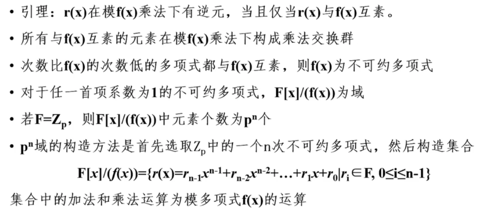

在网络安全方面，涉及到数据时，我们会关注很多事情。这些包括数据的 **Confidentiality**(机密性)，**integrity** (完整性)，**availability** (可用性) 和 **non-repudiation** (不可否认性)。

**Confidentiality** 意味着我们的数据不能被未经授权的用户访问/读取。

**integrity** 意味着我们的数据 100％ 还原，并且没有被修改，无论是由恶意参与者、数据丢失还是其他原因造成的。

**availability** 意味着我们的数据在需要时可以访问。

**non-repudiation** 意味着，如果 Bob 将一些数据发送给 Mary，那么他就不能在以后声称他不是那个信息的发送者。换句话说，有一些方法可以确定除了 Bob 之外没有人可以发送数据。

# 流加密 Chiffrement en continu

* XOR和générateur de codons -> 伪随机bits生成器

  是流加密的基础

  ***伪随机数生成器*** - PRNG生成的序列并不是真随机，因为它完全由一个初始值决定。

  ​								优点：生成速度快，可再现

* 流加密经常被用在communication codée上

* générateur de codons应该绝对同步（对通信中比特丢失的敏感性）某些生成器会自动同步

## RC4

* 由machine déterministre生成的周期性的伪随机数列
* 密码学上有额外的约束：周期越长越好（为了接近Vernam加密）
* 常用的生成器比如在加密中因为它的最大周期 état entièrement décrit par leur valeur而变得无用
* 像RC4这样的密码生成器
  * 可能状态的数量比取值的数量更加重要
  * 下一个状态的过渡函数很复杂
  * 初始状态取决于密钥

### 简单生成器的faiblesse

### RC4算法

当初始状态X0 = 0的时候， 0-9个数都能被覆盖

RC4生成伪随机通过在一个256个格子的S表（每一个格子是1个octet）交换。初始化时按照一个取决于密钥的随机顺序填满这256个格子

* 这个表因此被使用两个指针 i 和 j 的pas élémentaires 交换 (初始化时i = j = 0)

* i = i + 1 mod 256 (i = 0 + 1 = 1)

* j = j + S[i] mod 256 ( j =(0 + S[1]) mod 256 = 0 + 253 = 253)

* 交换S[i] S[j]

  

#### 初始化tableau（随机顺序取决于密钥）

* 线性填充 S[i] = i

* 制造另一个由密钥组成的tableau（适当情况下可以répétée，因为RC4的密钥有一个可变的长度）

* for (i = 0, i ≤ 255) 	

  ​	交换S[i]和S[j]

  

* RC4可以有256!*256^2个状态

* 在wifi（WEP，WPA）中还在使用RC4，但是WPA2使用AES

# 块加密(Chiffrement par blocs)

算法可以时对称的也可以是非对称的

* 一个块的明文变成一个相同大小的块密文（一般情况下是64bits或者128bits）

## Permutation & Substitution

### Permutation

是一种***双射***

双射就是一个集合映射到了自身

### Substitution

用其他的字母替代明文中的字母，而保持明文字母顺序

## ECB (electronic code book)

* 最简单的模式：ECB -> 独立块加密

  

  每个块使用相同的块加密

  ECB的缺点：一个攻击者可以保存许多的message来找规律，从而进行**Block replay**

  **Block replay** - connaître la structure san les déchiffrer et puis fabriquer un message à  sa convenance par assemblage

  这使得ECB fragile 如果仅仅使用ECB的话，所以我们一共和认证(authentification)一起用

## CBC (Mode Cipher Block Chaining)

为了避免这样的缺点(block replay)，可以使用不同形式的rétroaction**CBC**。第一个块使用了一个随机初始化向量**IV**

## DES (Data Encryption Standard)

* DES是一种古老的对称加密

* 每一个块64bit，同时密钥也是64bits（实际上只有56个bits用来加密，其他的bits用来控制密钥的intégrité）

* 将substitution 和 permutation融合起来

  目的是为了让每个bit的输出变成每个输入bit的伪随机函数

* DES已经被废弃，之后我们使用❓

### DES算法

一共16轮

e.g: 8bit明文 + 10bit密钥

#### 每一轮密钥的产生方式

1. 10bit每一位进行置换

2. 拆成两个部分

3. 每一个部分轮换一个bit **(left shift)** 轮换完的10个bits是下一轮的初始密钥

   每一轮轮换的位数都不一样

4. 然后再合成一个

5. 再根据一定的顺序取bit（10个bit里面抽出8个）(permutation compressive)

#### 每一轮密文的产生方式

1. 8bit每一位进行置换

2. 拆成两个部分

3. 每一部分轮换1个bit

4. 右边的4个bit不动直接放到新的左边

5. 然后对原先右边的4个bit做扩展和轮换的操作

   将4bit扩展成8bit（有规定的扩展规则）

6. 与密钥做异或（8bit）

7. 做替换（将8bit -> 4bit）Substitution

8. 再置换

9. 在和原先的的左边做异或，作为新的右侧

⚠️Substitution是根据一个 **Boite S** 决定的

### Boites S

DES的重点保密之处在于substitution的S表中，它将48bits替换成了32bits

主要由8个**Boite S**组成，每一个6个输入，4个输出

对于一个6输入4输出的S盒，可以看作是一个6*4的S盒

对于每一个6bits的输入，我们根据查看

* 首位两个bits来组成一个0-3的数 ->用来表示nº ligne
* 中间4个bits用来组成一个0-15之间的数 -> 用来表示nºcolonne
* 我们通过规定(nº ligne, nº colonne)来查表确定是哪个bit

### DES的解密和cryptanalyse

#### Déchiffrement

和加密算法一样使用密钥的倒序

#### Cryptanalyse

* DES最有效的破解方法是研究两个明文的密文的不同之处

* 密钥的长度太faible
* 有很多增加了DES密钥长度的加密变种，比如3DES

### UNIX系统的认证

* UNIX的系统认证建立在一个**crypt(3)**使用DES的单向加密上（正向容易计算，但是反向不容易计算）
* `/etc/passwd`或`/etc/shadow`不包含加密的密码，而是通过给定字符串（以密码为密钥）的**crypt（3）**加密（多次）的结果

#### Authentification过程：

用户：输入他的密码

系统：

1. 计算这个单向函数的结果

			2. 比对在`/etc/passwd`或`/etc/shadow`储存的结果

### 通过密码认证 - Attaque par dictionnaires

* 在字典攻击的情况下会有grande vulnérabilité

* 优化：加入**sel** (一个对于每个用户都不同的随机字符串，在进入单项函数计算之前和密码串联在一起)

  ​			但是**sel**一定会存储在`/etc/passwd`或者`/etc/shadow`中（为了能够让系统再次计算这个函数）

* 只是限制了在一些给定用户上的黑客行为

* 需要选择健壮的密码并且容易记忆

## Le successeur du DES - AES

输入：blocs de 128 bits avec une clé de longueur 128, 192 ou 256 bits

* 每一块128bits被认为是一个带有常用约定的16个octets的序列（每一个octet里的每一个bit会被倒序放置），之后这16个octets会按照一定的规定被放在一个4*4的tableau里面

  

* 可以将每一个octet写成一个多项式

  两个octets的加法是模2加法（相当于是每个bit逐个XOR）

  

* 两个octet的乘法是他们的多项式的乘法❓

* 与加法不同，在octet的乘法上不存在简单的操作

### Le corps fini GF(2^8)有限域

https://blog.csdn.net/luotuo44/article/details/41645597

* octets的集合有一个**GF(2^8)**的结构

  * 尤其是所有不为nul的元素有一个**逆元 inverse**，这是多项式m不可缩减的结果

  就是说**质数** （我们之后会证明**Euclide算法**：一个如果是另一个元素的**模逆元**，当且仅当他们是质数时成立❓）

  

* ❓我们证明每个有限域与m-1阶多项式的有限域是同构的，另外这个多项式的系数为整数，并且模p（p为质数），如果m> 1，则乘法是模一个m阶不可约多项式

* 在**GF(p^m)**中，p是域的特征，p^m是它的基数

* GF(p)是一个整数

* 对于每一个在**GF(p^m)**的元素

  

* 特别的，在**GF(2^8)**中对于每个元素u都有：u + u = 0，这意味着加法和减法是等效的（没有符号错误的风险！）

### 在GF(2^n)下的多项式运算

要弄懂GF(2^n)，要先明白多项式运算。这里的多项式和初中学的多项式运算有一些区别。虽然它们的表示形式都是这样的:f(x) = x^6 + x^ 4 + x^2 + x + 1。下面是它的一些特点。

1. 多项式的系数只能是0或者1。当然对于GF(p^n)，如果p等于3，那么系数是可以取：0， 1， 2的
2. 合并同类项时，系数们进行异或操作，不是平常的加法操作。比如x^4 + x^4等于0*x^4。因为两个系数都为1， 进行异或后等于0
3. 无所谓的减法(减法就等于加法)，或者负系数。所以，x^4 – x^4就等于x^4 + x^4。-x^3就是x^3。
   

### GF(2^8)乘法

### 寻找有限域中元素的逆元

前面的部分证明了如果a和b是互质的，那么我们就能找到u和v证明au + bv = 1

因此a就有一个模b的逆元

b有一个

# 对称加密

加密和解密需要一个密钥和一个算法。当加密和解密的密钥相同时，我们称之为对称加密

## 常见的对称加密

### DES

* 块加密，每一块64bits
* 每一块用一个56bit的的密钥加密
* 经常用在区块链中（CRC）

### RC4

* 使用一堆长度可变的密钥（直到长度变为2048bits）
* Ils sont largement utilisés pour rendre confidentiels des flux applicatifs

IDEA

Blowfish

### AES

* 块加密，每一块128bits
* 使用长度为128，192或者256bits的密钥
* 运行快速并且容易实现，并且只需要一点内存

# 非对称加密

私钥是一组随机书，公钥

## 公钥加密

所有的公钥加密算法（非对称加密）都是基于一些数学问题，正向简单，反向困难：

* 简单：计算两个大质数的乘积

  ​			计算a^x mod n (a, x, n都是大质数)

* 困难：计算出p和q

  ​			x

## Fonctions à sens unique à porte d'évitement secrète(trapdoor one-way function)

* 方程容易计算（一般计算乘积）
* 反向计算这个方程需要消耗大量的时间
* 但是如果我们知道un secret（两个因数中的一个），反向计算函数就会变得简单

## 椭圆曲线加密 ECC

https://zhuanlan.zhihu.com/p/36326221

* 很有可能是未来用于生成公钥的加密系统

* 建立在椭圆曲线上

* 该**群Group**的元素是满足一个称为Weierstrass方程的三次方程所相关的有限域中的点，<u>**并在该点上添加了一个无穷大的点**</u>，这是la loi de groupe的中性元素

  

* **La loi de groupe "addition"**的定义如下图

  

### 算法

1. 在椭圆曲线上找一个点**A(x, y)**，私钥是**K**
2. 公钥 **p = K(x, y) = KA**
3. **KA**专指椭圆乘法 -> 过**A**点作椭圆的切线，交椭圆曲线于另一点**B**，再继续做B点关于x轴点对称点**B‘**

1. **B’**就是 
   $$
   A + A = 2A
   $$
   

2. 再过**B‘**重复相同的步骤得到的新的点就是
   $$
   2A + 2A = 4A
   $$

所以即使**K**很大也可以很快地算，如果k = 2^n，复杂度是O(logn)，而不是O(2^n)

* 因此容易通过一个整数n（这个n就是私钥）来产生一个点（这个点就是公钥

* 由于离散对数的几何问题，这种算法很难进行反向运算

  公钥P = KA

  1. 如果P已知，难求K（A其实是规定好的） 
  2. 如果给定**K**值，可以在多项式时间内验证

## Diffie-Hellmann

DH使得密钥交换在一个non sûr的信道下发生，他源于公钥加密

它建立在la difficulté supposée du calcul de logarithmes discrets sur un corps fini:

* 选择两个超大质数 p 和 g

* g 是一个乘法群的生成器，g^k 序列应该遍历这个群的所有元素

* A随机生成一个大整数x（A的私钥）并计算A的公钥，然后发给B
  $$
  X = g^xmod \quad p
  $$

* B随机生成一个大整数y（B的私钥）并计算B的公钥，然后发给A
  $$
  Y = g^y mod\quad p
  $$

* 使用各自的私钥解密之后获得相同的结果
  $$
  K = g^{xy}mod \quad p
  $$
  这里的**K**就是双方之后对称加密使用的密钥

* indiscret仅仅知道 g, p, X 和 Y（最开始公开商定的两个超大质数还有双方公开的公钥）

* 由于不知道私钥x和y，indiscret没有任何简单的方法计算**K**，除非找到了它们，这相当于计算有限域**GF(P)**的离散对数。

## RSA

破解的困难在于因式分解(factorisation)

#### 算法

1. 终点选择两个大质数p和q 计算 n=pq，(p-1)(q-1)

2. 随机选一个e和上面的(p-1)(q-1)互质

3. 计算d

   

4. 公钥是(e,n) 私钥是d，销毁p和q

5. 明文m=2

   密文 c=

## 公钥加密的好处和坏处

* 解决了密钥的传输问题（公钥加密 => 我们可以加密一个message给一个我们从来没有遇到过的人）

* 比对称加密慢了很多

* **Une attaque <<à texte clair connu>>**

  加密密钥是公开的，一个黑客可以尝试多种明文，并且查看是否和密文匹配

* **Une attaque <<de l'intermédiaire>>**

  一个黑客可以用他自己的公钥代替发送者的公钥，并且截获，解密destination的message，之后用发送者的密钥再次加密并重新发给发送者

* 因此我们需要给公钥认证

# 数字签名

发送者用私钥加密（私钥只有发送者可以产生）

目的地用公钥解密

明文在被目的地的公钥加密前被盖章

## 银行卡的签名（RSA）

GIE

VI——卡的信息

VA——用GIE的私钥用RSA加密

卡诞生的时候，VA用GIE的公钥解密得到的结果是VI

仅仅计算(p-1)(q-1)和他的模逆元

# 生日攻击

# Fonctions de hachage

## A sens unique

* 哈希函数：一个

# SHA

# Certificats

## 三大问题

1. A和B之间如何保证用可信任的方式交换信息

   #### solution:

   沟通密钥，AES加密信息

2. A和B之间如何保证在交换密钥的过程中没有被黑客截获（这个时候还是对称加密）

   虽然我们在后续的通信中对明文进行了加密，但是第一次约定加密方式和密钥的通信仍然是明文，如果第一次通信就已经被拦截了，那么密钥就会泄露给中间人，中间人仍然可以解密后续所有的通信内容。

   #### solution:

   发送者发送RSA的公钥，目的地发送AES的私钥

   因为密钥很重要，所以在第一次交换确认密钥的时候要好好保护。B为了保护密钥不被截获，实现派了一个护卫（B的公钥**keyB_public**）去接应A产生的密钥**key_secret**并封印起来，并且只有B的私钥**keyB_private**可以命令护卫解除封印

3. A和B之间如何保证发送的公钥是对方的而不是被黑客替换的

   由于护卫只有一个，所以中间人可以截获这个护卫**keyB_public**，中间人自己生成一个假护卫**keyB‘_public**派他去接应A的密钥

公钥加密的弱点——**中间人攻击 l'attaque de l'intermédiaire**，如果公钥发送的方式是不确定的，可能会被窃取

中间人可以截获发送者发给目的地的信息并且解密（获取目的地的公钥），并且用目的地人的真正的密钥再次加密，在发送给目的地以此骗取私钥。

证书保证了公钥是正确的人的密钥

### AC

* 一方面发行自动证书通过可靠的途径（浏览器）发送给发送者

  发送者验证AC的签名

* 另一方面将识别信息+目的地的公钥

## SSL

浏览器融合了**modules de cryptographie**和**auto-certificats d'AC**两个模块

必要情况下，加密交流是可能的（比如https）

公钥加密太慢了，如果想快一点就用ssl

ssl两个人用对称加密，用的密钥是会话密钥

### 传输机制 三次握手

1. 第一次握手

   客户端：请求认证（是我！）+支持的加密方式

   服务器：证书+加密方式

2. 第二次握手（确认使用的会话密钥）

   客户端：验证证书（是你吗？）

   if ok -> 发送经过**服务器的公钥**加密的**会话密钥Clé de session**

   服务器：解密会话密钥

   使用这个会话密钥用对称算法加密发给客户端

# 量子加密

# TLS

保证服务器的身份

保护数据

‘保证消息不被改变

问题：

* 如果攻击者可以保存流量
* 如果密钥的交换是建立在RSA上的，密钥包含在里面

