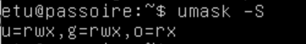
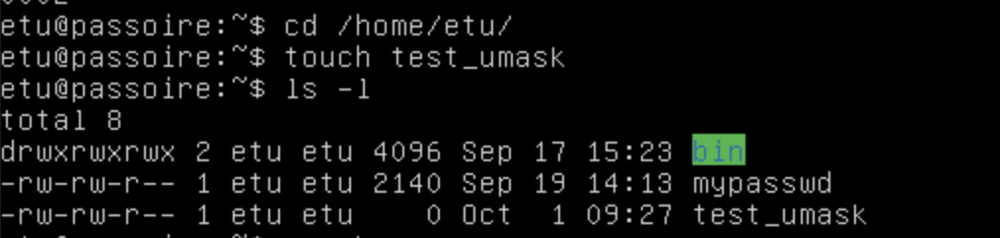
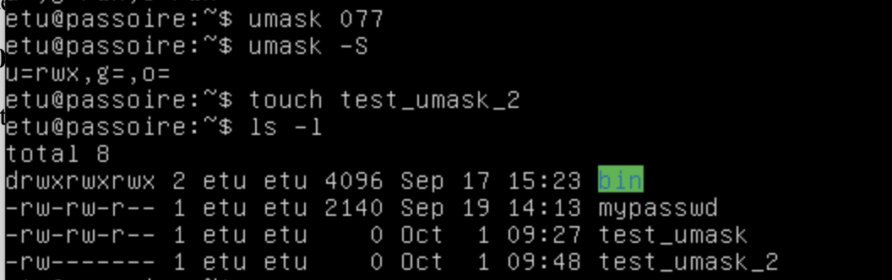
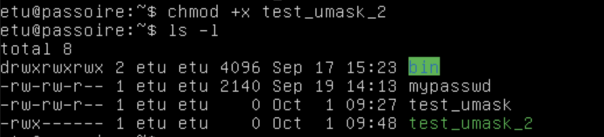
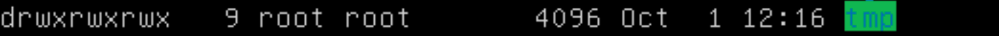
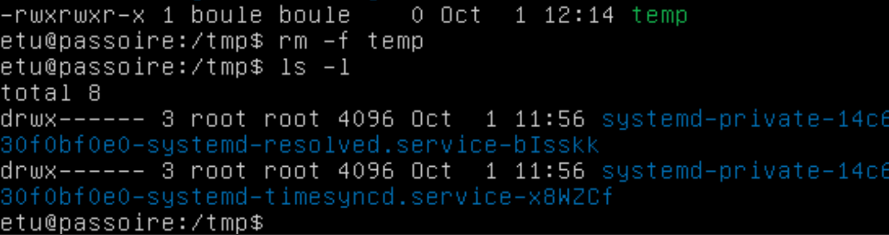
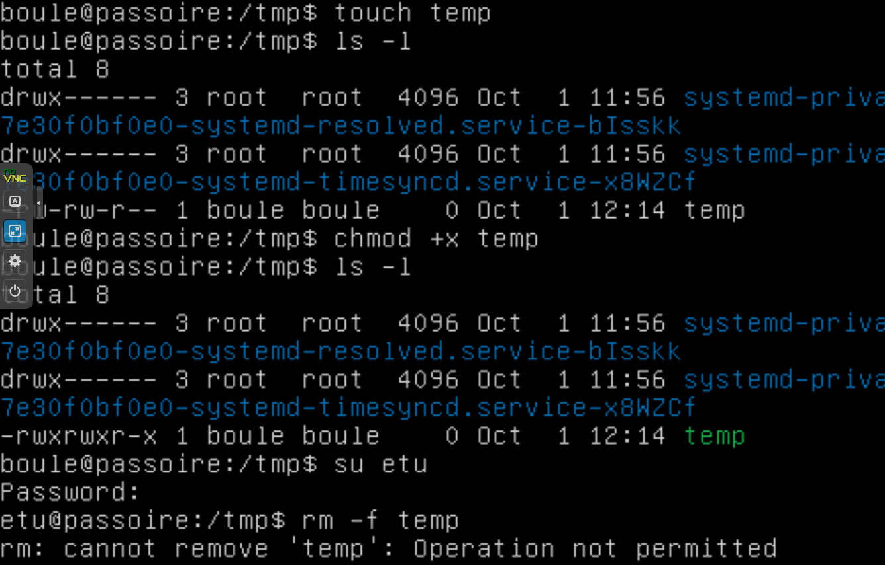

TD1

**Les exercices ci-dessous sont à réaliser dans votre clone de la machine virtuelle vm-passoire.**

# **2. Mots de passe**

Cet exercice permet de comprendre la vulnérabilité que représente un mot de passe trop simple.

- Utiliser unshadow pour préparer un fichier mypasswd : 

  ```shell
  sudo unshadow /etc/passwd /etc/shadow > mypasswd
  ```

- Lancer john sur le fichier mypasswd. Il est possible de restreindre la recherche à l'utilisateur etu via l'option -users:etu.

  ```shell
  sudo john -users:etu mypasswd
  sudo john -show mypasswd
  ```

  

- Retrouver les fichiers mis à jour dans le compte etu ; expliquer les droits des nouveaux fichiers.

  ```shell
  ls -altr
  ```
Un répertoire .john a été créé : il appartient à etu qui est le seul a en avoir les droits d'écriture lecture et exécution.
  

- Ajouter l'utilisateur boule, de mot-de-passe bill. Relancer john pour qu'il retrouve le mot de passe de boule tout en mesurant le temps nécessaire.

  ```shell
  sudo useradd boule
  sudo passwd <password>
  
  time john mypasswd -users:boule
  >real 0m17.145s
  ```
John arrive a craquer le mot de passe de Boule (bill) en 17 secondes.
  

- Sur passoire, vérifier les droits des fichiers /etc/passwd et /etc/shadow. Corriger-les ci-besoin.

```shell
ls -l /etc/passwd
ls -l /etc/shadow
```
Il est normal que /etc/passwd soit lisible par tous mais modifiable uniquement par `root` car il contient des données utiles à tous.

Par contre il n'est pas normal que que `/etc/shadow` soit lisible par tous car dans ce cas n'importe qui peut lancer john ou autre pour décripter des mots de passes.
Démonstration :

```shell
rm .john/*
time john /etc/shadow -users:boule

>bill (boule)
>real 0m27.557s
```

Les droits de `/etc/shadow` doivent donc être modifiés :

```shell
chmod go-rwx /etc/shadow 
```
ou 

```shell
chmod 600 /etc/shadow 
```
Pour gérer les acl (access control list)     i.e. les permissions spéciales

- Changer le mot de passe de l'utilisateur etu (retenir le mot de passe choisi !).

```shell
passwd
>ascefbth,

time john mypasswd -users:etu
>session aborted 
>real 25m16.154s 

john --restore
>session aborted 
>real 11m44.597s

john --restore
>session aborted 
>real 96m27.404s
```
Mot de passe plus sécurisé mais plus dur à retenir --> préférer une phrase longue (sinon banque de mots) ?


## **3. Configuration des droits  : utilisateurs**

Cet exercice permet de comprendre les droits des fichiers et des groupes.

| decimal |   droit    |
| :-----: | :--------: |
|    1    |    --x     |
|    2    |    -w-     |
|    3    |    -wx     |
|    4    |    r--     |
|    5    |    r-x     |
|    6    |    rw-     |
|    7    |    rwx     |
|  4000   |    suid    |
|  2000   |    guid    |
|  1000   | sticky-bit |

u —— user		g —— group		o —— other	

- Créer deux utilisateurs remus et romulus sur passoire. On suppose que leurs répertoires courants sont /home/remus et /home/romulus.

```shell
sudo useradd remus

grep remus /etc/passwd
>remus:x:1003:1003::/home/remus:/bin/sh

ls -a /home/remus
>No such file or directory

cd ~remus

sudo passwd remus
>remus

sudo mkdir /home/remus
sudo chown remus:remus /home/remus
```

```shell
sudo adduser romulus

grep romulus /etc/passwd
>romulus:x:1004:1004::/home/romulus:/bin/bash

ls -a /home/romulus
>.bash_logout .bashrc .profile

cd /home.romulus
```

- En tant qu'utilisateur remus, créer un fichier update.sh dans /home/remus, contenant l'instruction suivante : date >> /home/remus/log.txt

```shell
su - remus

echo 'date >> /home/remus/log.txt' > update.sh
```

- Ajouter les droits d'exécution à ce fichier.

  ```shell
  	chmod +x <filename>
  ```
  remarque : +x va considérer que c'est comme un a+x mais en applicant le mask alors que a+x n'applique pas le mask.

- Lancer en tant que remus update.sh. Que constatez-vous ?

```shell
./update.sh
```
Crée le fichier ``log.tx`` 

```shell
cat log.txt
><date du jour>
```
Comme prévu...

- Adapter les droits des fichiers update.sh et log.txt de sorte que l'utilisateur romulus puisse également exécuter update.sh.

```shell
su - romulus
romulus@passoire:~$ /home/remus/update.sh
> access denied : log.txt
```
--> changer les droits de log.txt pour que les autres (donc romulus compris) puissent écrire dedans.

```shell
exit
remus@passoire:~$ chmod o+w log.txt
/home/remus/log.txt
> <1er date>
> <2e date>
```

- Vérifier en vous connectant en tant que romulus et en lançant la commande udpdate.sh de remus.

- En tant que remus, enlever les droits de lecture, d'écriture et d'exécution pour 'other' sur le fichier log.txt. Refaire les étapes 4 et 6. Que constatez-vous ?


- En tant que etu, créer un groupe rome et y ajouter les utilisateurs remus et romulus.
```shell
etu@passoire:~$ sudo addgroup rome
sudo adduser remus rome
sudo adduser romulus rome
grep rome /etc/group
> rome:x:1005:remus, romulus
```
- En tant que remus, changer les groupes des fichiers update.sh et log.txt de sorte qu'ils appartiennent au groupe rome.

```shell
remus@passoire:~$ chown :rome update.sh log.txt
```

- Recommencer les étapes 4 et 6. Que constatez-vous ?

Ca marche.

- Faire en sorte que tous les fichiers dorénavant créés par remus appartiennent au groupe rome. Tester à nouveau l'étape 6.

```shell
remus@passoire:~$ newgrp rome
id
>gid = 1005 (rome) groups = 1005 (rome), 1003 (remus)
```

- Faire en sorte que ce comportement soit le comportement par défaut des utilisateurs remus et romulus. ❓

```shell
etu@passoire:~$ sudo usermod -g rome remus
grep remus /etc/passwd
>remus:x:1003:1005,,,:/home/remus:/bin/bash
```
Commentaire : remus n'est pas un sudoer il faut passer par le compte etu.


## **4. Configuration des droits : setuid**

Cet exercice permet de comprendre le droit spécial dit *setuid* et de corriger la machine virtuelle passoire.

- Comparer les droits des fichiers /usr/local/bin/readfile et /usr/local/bin/readfile-s. Le code de ce programme peut être retrouvé sur la page précédente.

  ```shell
  stat /usr/local/bin/readfile /usr/local/bin/readfile-s | grep Access
  ```

- Utiliser ces scripts pour visualiser les fichiers /etc/passwd, /etc/shadow, /etc/group, /etc/gshadow. Expliquer les droits de ces fichiers et les résultats obtenus.

|                           | /etc/passwd | /etc/shadow | /etc/group | /etc/gshadow |
| ------------------------- | ----------- | ----------- | ---------- | ------------ |
| /usr/local/bin/readfile   | oui         | non         | oui        | non          |
| /usr/local/bin/readfile-s | oui         | oui         | oui        | oui          |

​	cat <filename>

https://linuxconfig.org/how-to-use-special-permissions-the-setuid-setgid-and-sticky-bits

http://www.linux-france.org/article/memo/node19.html#461

- Sur la machine virtuelle passoire, ajouter le setuid bit au script update.sh de l'utilisateur remus (cf. exercice 3). En tant que utilisateur etu, lancer le script. Que constatez-vous ? Pourquoi ?

  ```shell
  remus@passoire:~$ chmod u+s update.sh
  ```
En tant que etu on ne peut pas lancer l'execution du fichier car les others n'ont aucun droit, donc il faudrait au moins rajouter les droits rx sur o. 
MAIS "on Linux, things that require an interpreter, including bytecode, can't make use of the setuid bit unless it is set on the interpreter (which would be very very stupid)." https://unix.stackexchange.com/questions/166817/using-the-setuid-bit-properly

- Expliquer les commandes suivantes : on pourra s'aider de man 2 stat (et du fichier /usr/include/linux/stat.h)

- -``` find / -user root -perm /u+s 2> /dev/null```

  chercher à partir de la racine? —— /

  find the file whose owner is root —— -user root

  find the file with setuid
  Remarque : -perm pour les permissions 

  2> /dev/null —— make stdeer redirect to /dev/null
  Remarque : équivalent à 2>&-

  On peut rediriger les messages d'erreur vers le "trou noir" (le périphérique /dev/null)

  ❓ -perm /u+s pourquoi on ajoute  "/"
  _For example -perm g=w will only match files which have mode 0020 (that is, ones for **which group write permission is the only permission set**). It is more likely that you will want to use the '/' or '-' forms, for example -perm -g=w, which matches **any file with group write permission**._

- - ```find / -type f \( -perm -2000 -o -perm -4000 \) -print 2 > /dev/null```

  ​			-  ```\( -perm -2000 -o -perm -4000 \)``` —— find the file with setuid or setgid
            - ```-o``` : ou
            - les parenthèses servent à grouper

  ​			- 2000 —— ❓ setgid only for floder,❓ , in this case we have indicated that it’s file (-type f) -> setgid est affectable pour les fichiers exécutables aussi (mais ne fait pas la même chose que sur les répertoires)
            - 2000 pour le setgid
            - 4000 pour le setuid

- - ```find / -type f -perm /u-s -perm /g+s -print 2> /dev/null```

  ​			- find the file with setgid but without setuid

- Estimer l'intérêt de ce bit selon les exécutables trouvés et au regard de l'usage de la machine. Enlever le *setuid bit* aux commandes qui ne sont pas utiles dans notre contexte.

❓ 

J'ai noté dans le cours du mardi : à enlever : chfn, chsh, pppd, 
Mais je ne sais pas pourquoi ?

## **5. Configuration des droits : umask** 

Cet exercice permet de comprendre les droits par défaut des fichiers et de corriger la machine virtuelle passoire.

- Afficher le masque par défaut. Créer un fichier (avec la commande touch) et constater les droits qui lui sont attribués.

  ```shell
  umask -S #check default rights while user creates a new file
  ```

  

  

  Il semble que le droit "x" ne peut être mis pour un nouveau fichier. Il faut le rajouter manuellement pour que le fichier devienne exécutable (si le mask l'autorise).

- Changer la valeur du masque de sorte que les fichiers créés aient aucun droits pour le groupe ni les autres utilisateurs. Vérifier en créant un fichier temporaire.

  ```shell
  umask 077 //aucun droits pour le groupe ni les autres utilisateurs
  umask g-rwx,o-rwx
  ```

  

  Quand l'on fait `chmod +x test_umask_2`

  

  Ça signifie que même si l'on essayait d'ajouter le droit d'exécuter avec `+x`, le groupe et des autres utilisateurs ne peuvent pas l'exécuter. 
  Par contre si l'on fait `o+x` ou `a+x` en précisant explicitement à qui (u, g, o ou a ) alors le mask n'est pas pris en compte.

- Rendre cette configuration permanente pour l'utilisateur etu. Vérifier en ouvrant une nouvelle session pour l'utilisateur etu.

```shell
grep umask .* 
```
. pour regarder dans les fichiers cachés (car les fichiers automatiquement lancés au démarage de bash sont cachés)

On voit alors que l'on peut modifier le mask dans .profile (même s'il est en commentaire donc on ne sait pas où il est défini de base ><')

```shell
emacs .profile
>#umask 002
```
On décommente et change la valeur.

```shell
>umask 077
```

Et il faut ensuite relancer le script

```shell
source .profile
```

Remarque : on utilise ```source``` pour que ce soit fait dans le même shell (et non pas dans un sous-shell fork() comme habituellement). 

- Changer la valeur du masque du système de sorte que le groupe ait uniquement le droit de lecture et les autres utilisateurs aucun droit.

Pour les **nouveaux utilisateurs crées** :

```shell
vim /etc/skel/.profile
```
même chose que précédement
  ```
  umask 037
  ```
Pour les autres changer manuellement ? 


Ou alors : Modifier directement le fichier /etc/profile (le premier utilisé quand on se log)

```shell
sudo vim /etc/profile

># force umask for all users
>umask 037
```  

## **6. Configuration des droits : sticky bit** 

Cet exercice permet de comprendre le droit spécial dit *sticky bit* et de corriger la machine virtuelle passoire.

The user can create new file in this folder but he can’t delete any other files in this folder.

- Créer un fichier temporaire avec l'utilisateur boule dans /tmp. Essayer d'effacer ce fichier avec l'utilisateur etu. Que constatez-vous ? Pourquoi ?

  

  

  On peut supprimer le fichier /tmp/temp avec l'utilisateur etu. 

  Maintenant, le répertoire /tmp n'est pas mis *sticky bit* et pour le fichier temp, les autres utilisateurs ont le droit access d'exécution.

- Expliquer la commande suivante et son intérêt :

- - find / -type d \ ( -perm -0002 -a \! -perm -1000 \ ) -print 2> /dev/null
  - ​		- find a folder with -0002 and without -1000 
  - ​		- start from root
  - ​		- ignore errors

- Réécrire la commande sans utiliser les codes 0002 et 1000.

  ​	0002  —— o+w

  ​	1000 —— sticky bit (SBIT)  personne ne peut le modifier

- Ajouter le sticky bit sur le répertoire /tmp et recommencer les opérations 1 et 2. Que constatez-vous ?

  ```shell
  sudo chmod 1777 /tmp
  ls -l /
  ```

  

  

L'utilisateur etu ne peut pas supprimer le fichier /tmp/temp

## **7. Corrections d'anomalies sur les fichiers**

Cet exercice est à réaliser sur la machine virtuelle passoire. Il permet de comprendre quelques vulnérabilités et de corriger la machine virtuelle passoire.

* [ ] Expliquer la commande suivante et son intérêt. Dans ce cas précis, quel risque encourt l'utilisateur etu ?

  ```shell
  find / -type d -perm /o+w -a \! -uid 0 -print 2> /dev/null
  ```

  * find folders which other users have write right and ???(J'ai pas le trouvé )

* [ ] Supprimer l'utilisateur boule avec la commande deluser boule. Expliquer la commande suivante et corriger l'anomalie trouvée :

  ```shell
  find / -type f \ ( -nouser -o -nogroup \ ) -print 2> /dev/null
  #(pour gagner du temps, il est possible de restreindre la recherche aux répertoires /home et /tmp)
  ```

* Expliquer la commande suivante et l'anomalie trouvée. Corrigez-la.

  - find / -type f -perm /u+x -perm /o+w -print 2> /dev/null