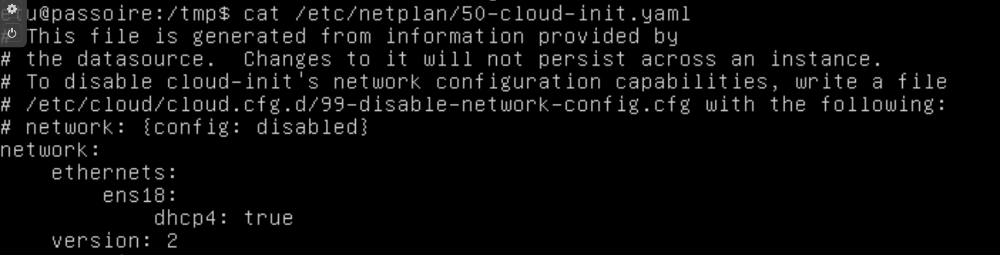
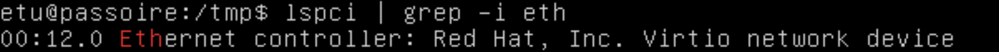
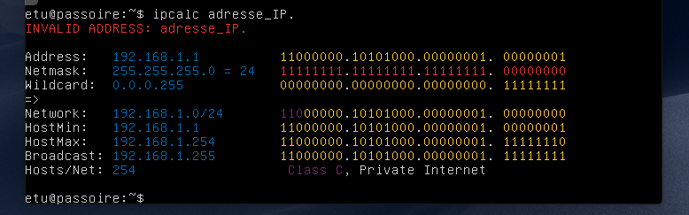
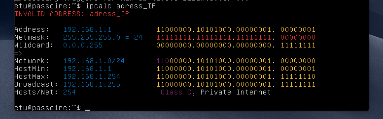
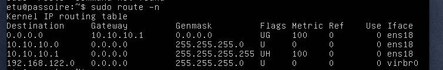
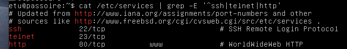
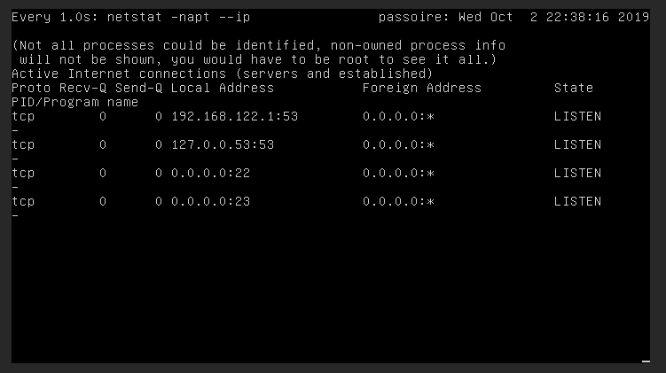
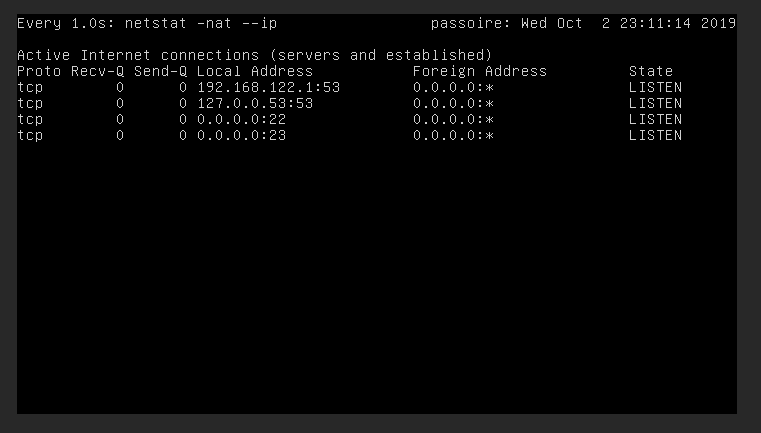

## **1. Configuration réseau de la machine virtuelle passoire**

 Nous commençons par adapter la configuration réseau de la machine virtuelle passoire.

### Configuration actuelle

   - Consulter la configuration réseau de la machine virtuelle dans la section Configuration/Hardware/Network Device de proxmox.

   - Dans la console de passoire, consulter la configuration réseau avec

     ```shell
     ifconfig ip address show
     ```

   - Consulter les fichiers /etc/network/interfaces et /etc/netplan/50-cloud-init.yaml. Que peut-on en déduire ?

     

   - Vérifier en comparant les commandes suivantes ; expliquer :

        - dpkg -l | grep ifupdown
          
          dpkg ne peut pas trouver la commande `ifupdown`
          
     - dpkg -l | grep netplan

### Modification de la configuration réseau

4. - En consultant /etc/netplan/50-cloud-init.yaml, déterminer la méthode utilisée pour l'attribution de l'adresse IP à passoire.

   - Relever l'adresse IP actuelle ; comparer avec un binôme voisin. Expliquer.

   - Consulter /etc/machine-id et comparer avec un binôme voisin.

   - Modifier l'ID de la machine virtuelle :

   - - Supprimer le fichier /etc/machine-id.

       删除machine_id

     - Générer un nouvel ID avec systemd-machine-id-setup.

       产生一个新的machine_id

     - Vérifier en consultant à nouveau /etc/machine-id. Comparer avec le binôme voisin.

   - Renouveler l'adresse IP :

   - - dhclient -r
     - Vérifier avec dhclient -v ou ifconfig ou ip address show.
     - Comparer avec le binôme voisin.

   - Suppression de l'interface réseau virb0

   - - Cette interface réseau virtuelle est ajoutée par ubuntu-serveur pour gérer la virtualisation. Elle est inutile ici.
     - Enlever l'interface virbr0 temporairement avec  `virsh net-destroy default`. Vérifier avec ifconfig -a
     - Empêcher sa création automatique au démarrage de la vm passoire avec `virsh net-autostart default --disable`.
       

### Vérifier vos connaissances sur :

- clone lié, clone intégral 
- netplan, ifupdown
- ip, ifconfig
- DHCP, dhclient


## **2. Réseau de deux VM**

Partant de la VM précédente, cet exercice permet de créer un réseau de deux VM et de réviser certaines connaissances en réseaux.

- Cloner la machine virtuelle passoire en réalisant un clone lié, appelé passoire-2bis".
- Lancer les deux VM passoire et passoire-2 et s'y connecter en tant qu'utilisateur etu.

### Couche 2

- - Déterminer le type de carte réseau avec la commande suivante :
    ```shell
    lspci | grep -i eth.
    ```
    
  
  - Installer l'application lynx. A quoi sert-elle ?
  
  - Isoler les adresses MAC de la VM à l'aide d'une commande. On pourra utiliser les commandes ifconfig, grep, tr et cut.
  
  - Interroger le site hwaddress.com avec lynx et la commande précédente en argument sur le modèle : lynx hwaddress.com/?q=`ifconfig ... `. Expliquer le résultat.
  
  - Est-ce qu'un contrôle d'accès réseau par adresse MAC représente une sécurité satisfaisante ?

### Couche 3


* [x] Vérifier que les deux VM ont deux adresses IP différentes.

​		passoire-TD —— 10.10.10.106

​		passoire-TD-2 —— 10.10.10.141

* [x] Installer le paquet ipcalc et vérifier jla nature des adresses IP :

  * apt-get install ipcalc -> sudo apt install ipcalc
  
- ipcalc adresse_IP.
  
  passoire-TD
  
    
  
  passoire-TD2
  
    
  
  - Ping 
  
    - Réaliser un ping depuis passoire vers passoire-2. Expliquer.
  
      ```shell
      ping 10.10.10.141 #dans passoire-TD
      ping 10.10.10.106 #dans passoire-TD2
      ```
  
    - Modifier la configuration de la carte réseau dans proxmox en décochant la case "Firewall" et recommencer le ping. Expliquer.
  
      ❓ why we can still connect to each other??? 
  
    - Comparer les champs TTL en réalisant un ping de passoire-2, de www.utc.fr et de www.google.fr. Expliquer.
  
      ```shell
      ping www.utc.fr # ttl=62
      ping www.google.fr # ttl=55
      ```
  
      
  
      TTL —— Le TTL est une donnée placée au niveau de l'[en-tête](https://fr.wikipedia.org/wiki/Header) du [paquet](https://fr.wikipedia.org/wiki/Paquet_(réseau)) [IP](https://fr.wikipedia.org/wiki/Internet_Protocol) qui indique le nombre maximal de [routeurs](https://fr.wikipedia.org/wiki/Routeur) de transit.  (8 bits)
  
  - Afficher la table de routage avec la commande route.
  
    ```shell
    sudo route -n		#sans DNS
    ```
  
    

### Couche 4

* [x] Déterminer le port de telnet, ssh et http en consultant le fichier /etc/services.

```shell
cat /etc/services | grep -E '^ssh|telnet|http'
```



* [x] Dans la VM passoire-2, lancer la commande `watch -n1 'netstat -napt --ip'`. Expliquer ce qu'elle fait.



❓We should use `-napt` or `-nat` ??

While executing `watch -n1 'netstat -napt --ip`

Execute `pring all the current connected address ip` periodically every 1 s

https://blog.51cto.com/sadoc/1932028 (chinois...)



- Depuis la VM passoire, lancer la commande `telnet` et constater l'établissement de la socket ainsi que ses différents états. ❓

  Telnet协议是TCP/IP协议家族中的一员，是Internet远程登陆服务的标准协议和主要方式。它为用户提供了在本地计算机上完成远程主机工作的能力。在终端使用者的电脑上使用telnet程序，用它连接到服务器。终端使用者可以在telnet程序中输入命令，这些命令会在服务器上运行，就像直接在服务器的控制台上输入一样。可以在本地就能控制服务器。要开始一个telnet会话，必须输入用户名和密码来登录服务器。Telnet是常用的远程控制Web服务器的方法。

### Vérifier vos connaissances sur :

- Modèle OSI

- Couche 2

  - lspci
    
    **lspci** est une commande sous [Unix](https://fr.wikipedia.org/wiki/Unix) (et [GNU/Linux](https://fr.wikipedia.org/wiki/GNU/Linux)) qui affiche des informations très détaillées sur les [périphériques](https://fr.wikipedia.org/wiki/Périphérique_(informatique)) du [bus PCI](https://fr.wikipedia.org/wiki/Peripheral_Component_Interconnect) d'un ordinateur.
    
  - adresse MAC

#### Couche 3

* adresses IP publiques et privées, NAT

- ping,

- route

- champ TTL

  TTL —— Le TTL est une donnée placée au niveau de l'[en-tête](https://fr.wikipedia.org/wiki/Header) du [paquet](https://fr.wikipedia.org/wiki/Paquet_(réseau)) [IP](https://fr.wikipedia.org/wiki/Internet_Protocol) qui indique le nombre maximal de [routeurs](https://fr.wikipedia.org/wiki/Routeur) de transit.  (8 bits)

#### Couche 4

- - numéros de port, fichier /etc/services
  - sockets
  - netstat

- Problématiques de sécurité

- - Confidentialité des adresses
  - Usurpation des adresses -> 侵占，窃取地址
  - Découverte de réseau


## **3. Noms des machines**

Cet exercice permet de comprendre le nommage des machines.

### 1. Nom de la machine locale -> 修改主机名

* [x] Que donnent les commandes `uname -a `et `hostname` ?

  `uname`: print system information


* [x] Renommer la VM passoire-2 en passoire-2 :

  * [x] Utiliser la commande suivante : `hostnamectl set-hostname passoire-2`.
  * [x] Ajouter la ligne "127.0.01 passoire-2" au fichier /etc/hosts

  ```shell
  sudo echo "127.0.01 passoire-2" >> /etc/hosts # permission denied ??
  ```

  * [x] Redémarrer la machine et vérifier le changement de nom.

### 2. Nom des machines distantes -> 修改远程主机名

* [x] Ajouter une ligne "@IP passoire-2" dans le fichier `/etc/hosts`v de la machine passoire (remplacer @IP par l'adresse IP de passoire-2).

* [x] Vérifier avec la commande suivante, lancée depuis passoire : `telnet passoire-2 -l etu`.

  Il nous permet de connecter sur `passoire-TD2` avec la VM `passoire-TD`


* How to exit telnet:

`ctrl + ]` and then `q`

* [x] Faîtes de même sur passoire-2.
* [x] Vérifier les connexions avec `netstat -napt --ip` puis avec `netstat -apt --ip`.


| netstat |                                   |
| :-----: | :-------------------------------: |
|   -a    |             show all              |
|   -n    |           prohibit DNS            |
|   -t    |             only TCP              |
|   -p    | show info of process (using root) |
|   -u    |             only UPD              |
|   -c    |          keeping output           |

在VM-TD2上远程登录TD的账户，在该账户中使用`netstat`看到有与`10.10.10.92`（TD2的ip）的链接

### 3. Configuration locale du serveur de nom -> 配置本地服务器的名字

* [x] Retrouver les adresses IP des machines www.utc.fr et www.google.fr avec la commande `dig`.

  www.utc.fr


* www.google.fr

  

* [ ] Inversement, retrouver le nom d'une machine en partant d'une adresse IP avec la commande `dig -x`.

  ```shell
  dig -x
  ```

* [ ] Quel est le rôle des fichiers /etc/nsswitch.conf et /etc/resolv.conf ?

  * `/etc/resolv.conf` 为了DNS

* [ ] Retrouver le programme en charge du service avec ps aux | grep resolv et noter son numéro (pid).

  ```shell
  ps | grep resolv???
  ps # just two processes are running???
  ```

* [ ] Vérifier avec `netstat -nap --ip` (à lancer en tant qu'administrateur pour voir les programmes associés aux sockets).


* [ ] Stopper ce processus avec kill -STOP pid et recommencer les commandes dig ci-dessus. Que constatez-vous ?
* [ ] Relancer le programme avec kill -CONT pid et vérifier que les commandes dig fonctionnent.

### 4. Requête au serveur de nom

* [x] Depuis passoire-2, se connecter sur passoire en telnet avec le compte etu.
* [ ] Lancer la commande `sudo netstat -napuc` (alternativement, on pourra utiliser watch -1 'netstat -napu'). Expliquer cette commande et son résultat.
* [ ] Réaliser ensuite des requêtes dig depuis passoire et constater l'évolution de l'affichage dans la commande précédente.

### 5. Configuration à l'UTC

* [ ] Retrouver la configuration du serveur de nom de la machine hôte.
* [ ] Retrouver les serveurs de nom de l'UTC.

### Vérifier vos connaissances sur :

- uname
- hostname
- /etc/hostname, /etc/hosts
- dig
- /etc/resolv.conf, /etc/nsswitch.conf


## **4. Nouvelle interface réseau**

Dans cet exercice, on complète la vm passoire avec une nouvelle interface réseau.

* [ ] Dans la configuration de la machine virtuelle passoire (onglet Configuration/Hardware de proxmox), ajouter une interface réseau :

- - Bridge : vmbr1 (ie. valeur différente de l'interface réseau déjà présente)
    * [ ] VLAN Tag : no VLAN
    * [ ] Model : VirtIO
    * [ ] Mac address : auto
    * [ ] Firewall : ne pas cocher la case.

- Relancer passoire et récupérer le nom de l'interface réseau ainsi créée avec dmesg | grep -i eth.

- Editer le fichier /etc/netplan/50-cloud-init.yaml afin d'ajouter la configuration de cette nouvelle interface. La configuration est similaire à la première. Attention à ne pas utiliser de tabulations.

- Demander l'attribution d'une IP avec dhclient et vérifier avec ifconfig ou ip address show.


## **5. Sécurité des communications**

Cet exercice porte sur la confidentialité des communications et l'intérêt du chiffrement. Attention à bien respecter les consignes. Relire les articles [323-1](https://www.legifrance.gouv.fr/affichCodeArticle.do;?idArticle=LEGIARTI000030939438&cidTexte=LEGITEXT000006070719&dateTexte=20180926) et [323-3-1](https://www.legifrance.gouv.fr/affichCodeArticle.do;?idArticle=LEGIARTI000028345220&cidTexte=LEGITEXT000006070719) du code pénal au préalable.

### Capture de trafic avec tcpdump

2. 1. Sur passoire-2, lancer la commande suivante : ping passoire.
   2. Via quelle interface réseau la machine virtuelle passoire reçoit-elle les paquets ping en provenance de passoire-bis ?
   3. Sur passoire, lancer la commande suivante en adaptant le nom de l'interface : sudo tcpdump -n -i interface.
   4. Expliquer la commande et les résultats obtenus.

### Capture de contenu avec tcpdump

4. 1. Sur passoire, lancer la commande suivante : sudo tcpdump -n -i interface 'port 23' -X.
   2. Sur passoire-bis, lancer la commande suivante : telnet passoire -l etu.
   3. Expliquer les commandes et les résultats obtenus. Retrouver l'information sensible.

### Visualisation graphique avec Wireshark

6. 1. Sur le système hôte, identifier les adresses IP et notamment celle le connectant à la machine virtuelle passoire.
   2. Sur passoire, lancer la commande suivante : sudo tcpdump -s0 -n -U -w - -i interface 'not port 3000' | nc @IP_hôte 3000.
   3. Sur le système hôte, lancer ensuite la commande : nc -k -l 3000 | wireshark -k -i -
   4. Expliquer les différentes commandes. Que constatez-vous ?
   5. Observer l'encapsulation des paquets dans Wireshark et les différents champs des entêtes (adresses MAC, adresses IP, drapeaux IP, numéros de port et options TCP...).
   6. Ajouter un trafic ping entre passoire et passoire-bis.
   7. Via un clic droit sur l'un des paquets du flux TCP, afficher le contenu du flux (menu Follow TCP stream). Que constatez-vous

### Connexion ssh

8. 1. Depuis passoire, se connecter en ssh sur passoire-bis.
   2. Suivre la communication avec Wireshark. Que constatez-vous ?
   3. Corriger passoire afin d'interdire les communications non chiffrées.


### Vérifier vos connaissances sur :

- tcpdump
- wireshark
- telnet
- ssh
- confidentialité des communications


## **5. Découverte de services**

Cet exercice porte sur la détection à distance de services réseaux. Attention à bien respecter les consignes. Relire l'article [323-3-1](https://www.legifrance.gouv.fr/affichCodeArticle.do;?idArticle=LEGIARTI000028345220&cidTexte=LEGITEXT000006070719) du code pénal au préalable.

1. Installer le paquet nmap sur passoire-2. Consulter ensuite le man de la commande nmap. Comment classer cette commande ?

2. Isolation du réseau.

3. 1. Afin de rester dans le réseau privé d'hôte, démonter l'interface réseau en NAT sur passoire-bis avec la commande : sudo ip link set ens18 down. Adapter si besoin le nom de l'interface.
   2. Vérifier avec ifconfig qu'il ne reste plus que l'interface connectée au réseau vmbr1.
   3. Est-il encore possible de télécharger un paquet logiciel sur la machine virtuelle ?

4. Depuis passoire-2, lancer la commande suivante : nmap passoire.

5. A l'aide de tcpdump ou wireshark (cf. exercice précédent), observer le trafic généré par nmap.

6. Réaliser un scan UDP sur passoire.

7. Réaliser une découverte d'OS sur passoire et sur l'adresse 192.168.56.1

8. Pour réactiver l'interface réseau qui avait été désactiver, utiliser sudo ip link set eth1 up.


### Vérifier vos connaissances sur :

- nmap
- scan de port


## **6. Segmentation des privilèges** 

Cet exercice porte sur les comptes de service et la séparation des privilèges.

1. Comptes de service

2. 1. Compter le nombre d'utilisateurs définis dans le fichier /etc/passwd. Expliquer.

   2. Que font les commandes nologin et false ?

   3. Expliquer les commandes suivantes et leur résultat.

   4. 1. grep -v home /etc/passwd | grep bash
      2. grep -v nologin /etc/passwd | grep -v false

   5. Corriger l'anomalie trouvée.

3. Droit spécifique pour relancer Apache

4. 1. Que fait la commande apache2ctl ?

   2. Vérifier que les utilisateurs remus et romulus ne peuvent relancer le serveur web de passoire.

   3. Ouvrir un autre terminal et lancer la commande suivante pour constater les essais infructueux de remus et romulus : tail -f /var/log/auth.log.

   4. En tant qu'utilisateur etu, éditer le fichier /etc/sudoers avec la commande : sudo vi /etc/sudoers.

   5. 1. Dans la section *User alias specification*, ajouter la ligne : User_Alias ROMAINS=remus,romulus
      2. Dans la section *Cmnd alias specification,* ajouter la ligne : Cmnd_Alias APACHE=/usr/sbin/apache2ctl
      3. A la fin de la section *User privilege specification*, ajouter la ligne : ROMAINS ALL=APACHE

   6. Vérifier que les utilisateurs remus et romulus peuvent maintenant relancer le site web.

5. Droit spécifique pour éditer le site web

6. 1. A qui appartient la page web par défaut du site web de passoire ?

   2. En tant qu'utilisateur etu, changer récursivement le user et le group du répertoire /var/www/html de sorte qu'il appartienne à www-data.

   3. Vérifier que l'utilisateur etu peut éditer le fichier index.html sans modifier ses droits avec la commande : sudo -u www-data vi /var/www/html/index.html.

   4. Modifier ce fichier pour qu'il affiche simplement "Bienvenue" aux visiteurs. Vérifier depuis passoire-2 avec la commande lynx.

   5. Ajouter un utilisateur cesar et faire en sorte qu'il puisse éditer le fichier index.html de deux manières différentes :

   6. 1. En modifiant le fichier sudo
      2. En utilisant les groupes.


### Vérifier vos connaissances sur :

- La configuration des comptes de service
- La commande sudo et le fichier /etc/sudoers
- La page par défaut du serveur web Apache


## **7. Isolation d'un utilisateur** 

Cet exercice porte sur l'isolation d'un utilisateur à l'aide de chroot. La même technique peut être appliquée pour isoler un service.

1. Construction de l'isolation minimale

2. 1. Créer le répertoire /var/isoler qui servira de "cage" pour notre isolation. Ajouter le répertoire /var/isoler/bin.
   2. Copier /bin/bash dans /var/isoler/bin.
   3. Rechercher les bibliothèques partagées utilisées par bash avec la commande suivante : ldd /bin/bash.
   4. Copier ces bibliothèques dans la cage ; créer pour cela les répertoires /var/isoler/lib, /var/isoler/lib64, /var/isoler/lib/x86_64-linux-gnu. On veillera à ne copier que les bibliothèques nécessaires à l'exécution de bash.

3. Utilisation de la cage construite

4. 1. Lancer l'environnement isolé avec la commande suivante : chroot /var/isoler.
   2. Exécuter les commandes suivantes : pwd, echo *, cd bin, echo *, pwd
   3. Pourquoi ces commandes sont acceptées ?
   4. Essayer d'autres commandes telles que ls, vi, df...

5. Compléments

6. 1. Ajout des commandes ps et ls avec la même méthode que pour bash ci-dessus :

   2. 1. Copie des exécutables.
      2. Recherche des bibliothèques partagées nécessaires.
      3. Copie des bibliothèques partagées.
      4. Vérifier au sein de l'environnement isolé.

   3. Ajout du périphérique spécial null :

   4. 1. Créer le répertoire pour les *devices* : mkdir /var/isoler/dev
      2. Créer le périphérique null : mknod /var/isoler/dev/null c 1 3
      3. Vérifier avec la commande suivante dans l'environnement isolé : ls bin toto 2> /dev/null

   5. Ajout du pseudo système de fichier /proc qui contient des informations sur (tout) le système en exécution :

   6. 1. Créer le point de montage : mkdir /var/isoler/proc
      2. Monter le pseudo système de fichier une seconde fois (il l'est déjà dans /proc) : mount --bind /proc /var/isoler/proc
      3. Au sein de l'environnement isolé, examiner les informations relatives aux processus auxquelles /var/isoler/proc donne accès.

7. Création d'un utilisateur ayant un shell isolé

8. 1. Ecrire un shell-script /usr/local/bin/isoler.sh contenant les lignes suivantes :

   2. 1. \#!/bin/bash
      2. echo "Bienvenue dans ce shell isolé par chroot"
      3. /usr/sbin/chroot /var/isoler/ /bin/bash

   3. Ajouter les droits d'exécution à ce script.

   4. Ajouter l'utilisateur de login *minus* qui aura pour *home directory* le répertoire /var/isoler et pour shell /usr/local/bin/isoler.sh via la commande suivante : useradd -c minus -d /var/isoler -s /usr/local/bin/isoler.sh

   5. Attribuer un mot de passe à minus avec la commande passwd.

   6. Ajouter le setuid bit à chroot.

   7. Tester en se connectant en tant que utilisateur minus.