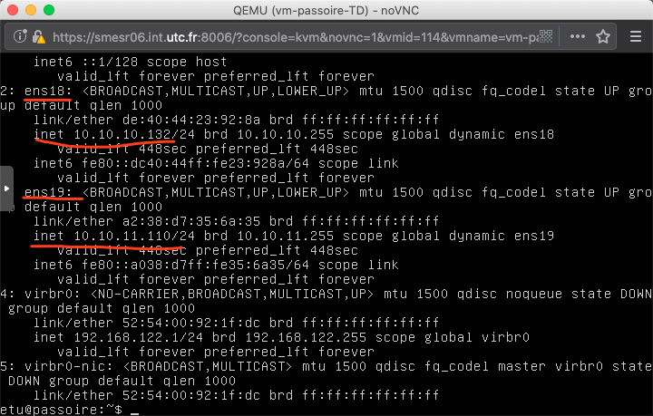
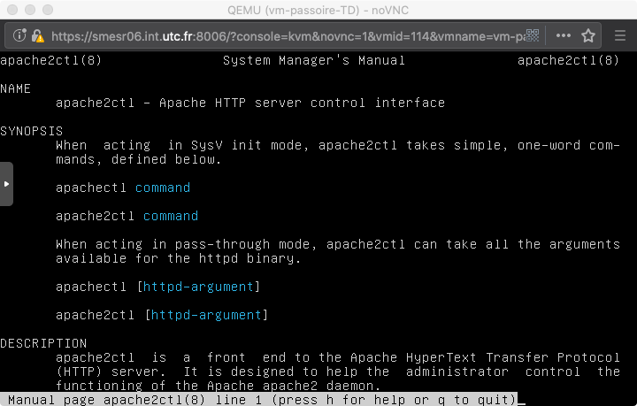
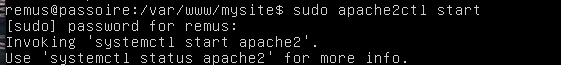

## **1. Configuration réseau de la machine virtuelle passoire**

 Nous commençons par adapter la configuration réseau de la machine virtuelle passoire.

### Configuration actuelle

* [x] Consulter la configuration réseau de la machine virtuelle dans la section Configuration/Hardware/Network Device de proxmox.
* [x] Dans la console de passoire, consulter la configuration réseau avec

```shell
ifconfig 
ip address show
```

* [x] Consulter les fichiers `/etc/network/interfaces` et `/etc/netplan/50-cloud-init.yaml`. Que peut-on en déduire ?


* [x] Vérifier en comparant les commandes suivantes ; expliquer :
  * dpkg -l | grep ifupdown

    dpkg ne trouve pas le package `ifupdown` dans ceux installés

  * dpkg -l | grep netplan
    
    netplan est installé

### Modification de la configuration réseau

* [x] **En consultant `/etc/netplan/50-cloud-init.yaml`, déterminer la méthode utilisée pour l'attribution de l'adresse IP à passoire.**

    Attribution de l'adresse IP par le protocole DHCP4 pour ens18.
* [x] **Relever l'adresse IP actuelle ; comparer avec un binôme voisin. Expliquer.**

```shell
 ip address show
```

* [x] **Consulter `/etc/machine-id` et comparer avec un binôme voisin.**

* [ ] **Modifier l'ID de la machine virtuelle :**

  * [ ] **Supprimer le fichier `/etc/machine-id`.**
  * [ ] **Générer un nouvel ID avec `systemd-machine-id-setup`.**
  * [ ] **Vérifier en consultant à nouveau `/etc/machine-id`. Comparer avec le binôme voisin.**

* [ ] **Renouveler l'adresse IP :**

  ```bash
  sudo dhclient -r
  ```

* [ ] **Vérifier avec `dhclient -v` ou `ifconfig` ou `ip address show`. Comparer avec le binôme voisin.**

* [x] **Suppression de l'interface réseau virb0**

  **Cette interface réseau virtuelle est ajoutée par ubuntu-serveur pour gérer la virtualisation. Elle est inutile ici.**

  * [x] **Enlever l'interface virbr0 temporairement avec  `virsh net-destroy default`. Vérifier avec `ifconfig -a`**

  * [x] **Empêcher sa création automatique au démarrage de la vm passoire avec `virsh net-autostart default --disable`.**

### Vérifier vos connaissances sur :

- clone lié, clone intégral 
- netplan, ifupdown
- ip, ifconfig
- DHCP, dhclient


## **2. Réseau de deux VM**

Partant de la VM précédente, cet exercice permet de créer un réseau de deux VM et de réviser certaines connaissances en réseaux.

- Cloner la machine virtuelle passoire en réalisant `un clone lié`, appelé passoire-2bis".
- Lancer les deux VM passoire et passoire-2 et s'y connecter en tant qu'utilisateur etu.

### Couche 2

* **Déterminer le type de carte réseau avec la commande suivante :**

```shell
lspci | grep -i eth.
```


- **Installer l'application lynx. A quoi sert-elle ?**

Un browser en mode text.

- **Isoler les adresses MAC de la VM à l'aide d'une commande. On pourra utiliser les commandes ifconfig, grep, tr et cut.**

```shell
ifconfig  | grep ether
>  ether   ae:35etc.   twqueuelen   1000   (ethernet)
ifconfig  | grep ether | tr -s ' ' '/' #remplacer les espaces successifs par un seul / pour le cut
>/ether/ae:35etc./twqueuelen/1000/(ethernet)
ifconfig  | grep ether | tr -s ' ' '/' | cut -d/ -f3 #d=delimiteur --> crée des champs f=field et on prend le troisième
```

- **Interroger le site hwaddress.com avec lynx et la commande précédente en argument sur le modèle : lynx hwaddress.com/?q=`ifconfig ... `. Expliquer le résultat.**

```shell
lynx hwaddress.com/?q=`ifconfig  | grep ether | tr -s ' ' '/' | cut -d/ -f3` #au lieu des ` on peut mettre $( )
```
L'adresse mac n'existe pas "No records found matching ae:35etc. " --> c'est une machine virtuelle ?

- **Est-ce qu'un contrôle d'accès réseau par adresse MAC représente une sécurité satisfaisante ?**
 
Non car on peut forcer l'adresse mac.

### Couche 3


* [x] **Vérifier que les deux VM ont deux adresses IP différentes.**

​		passoire-TD —— 172.23.3.20/16

​		passoire-TD-2 —— 172.23.3.21/16

* [x] **Installer le paquet ipcalc et vérifier la nature des adresses IP :**

  * apt-get install ipcalc -> sudo apt install ipcalc
  
  * ipcalc adresse_IP (il doit remplacer vrai @ip ici......) --> je pense qu'il faut plutôt remplacer adresse_IP par la vrai adresse ip
  
  passoire-TD
  
  
  
  passoire-TD2  

* **Ping** 

  * [x] **Réaliser un ping depuis passoire vers passoire-2. Expliquer.**

Ca marche. On est sous le même sous-réseau ?

  * [ ] **Modifier la configuration de la carte réseau dans proxmox en décochant la case "Firewall" et recommencer le ping. Expliquer.**

    ❓ why we can still connect to each other??? 

  * [ ] **Comparer les champs TTL en réalisant un ping de passoire-2, de www.utc.fr et de www.google.fr. Expliquer.**
  
  ```shell
  ping www.utc.fr # ttl=62
  ping www.google.fr # ttl=55
  ```

  ​		TTL —— Le TTL est une donnée placée au niveau de l'[en-tête](https://fr.wikipedia.org/wiki/Header) du [paquet](https://fr.wikipedia.org/wiki/Paquet_(réseau)) [IP](https://fr.wikipedia.org/wiki/Internet_Protocol) qui indique le nombre maximal de [routeurs](https://fr.wikipedia.org/wiki/Routeur) de transit. La valeur recommandée par le RFC 17002 est de 64. (8 bits) 

Entre passoire 1 et 2 il n'y a aucun routeur de transit donc il reste 64 d'acceptable.
Ce qui implique que entre passoire 1 et utc il y en a 2.
Entre passoire 1 et google il y en a 9. 

  * [ ] **Afficher la table de routage avec la commande route.**

  ```shell
  sudo route -n		#sans DNS
  ```

  

### Couche 4

* [x] **Déterminer le port de telnet, ssh et http en consultant le fichier /etc/services.**

```shell
grep -E '^(ssh|telnet|http)\s' /etc/services
```


* [x] **Dans la VM passoire-2, lancer la commande `watch -n1 'netstat -napt --ip'`. Expliquer ce qu'elle fait.**


​	❓We should use `-napt` or `-nat` ??  le p sert à savoir le nom du programme qui utilise le port mais n'est visible que si l'on est en sudo 

​	While executing `watch -n1 'netstat -napt --ip`

​	Execute `pring all the current connected address ip` periodically every 1 s

​	https://blog.51cto.com/sadoc/1932028 (chinois...)

ça permet de voir toutes les connections aux ports réseaux (netsat -napt --ip) toute les secondes (-n1).
Ici ssh (22), telnet (23) et le dns (53) sont en écoute.


* [x] **Depuis la VM passoire, lancer la commande `telnet` et constater l'établissement de la socket ainsi que ses différents états.** ❓

Telnet协议是TCP/IP协议家族中的一员，是Internet远程登陆服务的标准协议和主要方式。它为用户提供了在本地计算机上完成远程主机工作的能力。在终端使用者的电脑上使用telnet程序，用它连接到服务器。终端使用者可以在telnet程序中输入命令，这些命令会在服务器上运行，就像直接在服务器的控制台上输入一样。可以在本地就能控制服务器。要开始一个telnet会话，必须输入用户名和密码来登录服务器。Telnet是常用的远程控制Web服务器的方法。

```shell
telnet <adresse_ip d'où l'on veut se connecter>
```

On remarque bien que passoire 1 s'est connectée à passoire 2 en telnet car il y aune connexion etablie ayant pour adresse locale l'ip de passoire 1 et en foreign adresse celle de passoire 2 avec pour programme in.telnetd. 


### Vérifier vos connaissances sur :

- Modèle OSI

- Couche 2

  - lspci
    
    **lspci** est une commande sous [Unix](https://fr.wikipedia.org/wiki/Unix) (et [GNU/Linux](https://fr.wikipedia.org/wiki/GNU/Linux)) qui affiche des informations très détaillées sur les [périphériques](https://fr.wikipedia.org/wiki/Périphérique_(informatique)) du [bus PCI](https://fr.wikipedia.org/wiki/Peripheral_Component_Interconnect) d'un ordinateur.
    
  - adresse MAC

#### Couche 3

* adresses IP publiques et privées, NAT

- ping,

- route

- champ TTL

  TTL —— Le TTL est une donnée placée au niveau de l'[en-tête](https://fr.wikipedia.org/wiki/Header) du [paquet](https://fr.wikipedia.org/wiki/Paquet_(réseau)) [IP](https://fr.wikipedia.org/wiki/Internet_Protocol) qui indique le nombre maximal de [routeurs](https://fr.wikipedia.org/wiki/Routeur) de transit.  (8 bits)

#### Couche 4

- - numéros de port, fichier /etc/services
  - sockets
  - netstat

- Problématiques de sécurité

- - Confidentialité des adresses
  - Usurpation des adresses -> 侵占，窃取地址
  - Découverte de réseau


## **3. Noms des machines**

Cet exercice permet de comprendre le nommage des machines.

### 1. Nom de la machine locale -> 本地主机名

* [x] **Que donnent les commandes `uname -a `et `hostname` ?**

  `uname`: print system information


* [x] **Renommer la VM passoire-2 en passoire-2 :**

  * [x] **Utiliser la commande suivante : `hostnamectl set-hostname passoire-2`.**
  * [x] **Ajouter la ligne "127.0.01 passoire-2" au fichier /etc/hosts**

  ```shell
  sudo echo "127.0.01 passoire-2" >> /etc/hosts # permission denied ??
  ```

  * [x] **Redémarrer la machine et vérifier le changement de nom.**

### 2. Nom des machines distantes -> 远程主机名

* [x] **Ajouter une ligne "@IP passoire-2" dans le fichier `/etc/hosts`v de la machine passoire (remplacer @IP par l'adresse IP de passoire-2).**

* [x] **Vérifier avec la commande suivante, lancée depuis passoire : `telnet passoire-2 -l etu`.**

  Il nous permet de connecter sur `passoire-TD2` avec la VM `passoire-TD`


* How to exit telnet:

  `ctrl + ]` and then `q`

* [x] **Faîtes de même sur passoire-2.**

* [x] **Vérifier les connexions avec `netstat -napt --ip` puis avec `netstat -apt --ip`.**

  https://linux.cn/article-2434-1.html


| netstat |                                   |
| :-----: | :-------------------------------: |
|   -a    |             show all              |
|   -n    |           prohibit DNS            |
|   -t    |             only TCP              |
|   -p    | show info of process (using root) |
|   -u    |             only UPD              |
|   -c    |          keeping output           |
|   -l    |             listening             |

在VM-TD2上远程登录TD的账户，在该账户中使用`netstat`看到有与`10.10.10.92`（TD2的ip）的链接

### 3. Configuration locale du serveur de nom -> 本地域名服务器的配置

* [x] **Retrouver les adresses IP des machines www.utc.fr et www.google.fr avec la commande `dig`.**

  www.utc.fr


* www.google.fr

  

* [x] **Inversement, retrouver le nom d'une machine en partant d'une adresse IP avec la commande `dig -x`.**

  ```shell
  dig -x <@ip>
  ```

* [x] **Quel est le rôle des fichiers /etc/nsswitch.conf et /etc/resolv.conf ?**

  * /etc/hosts

    affecter DNS à la main

  * `/etc/resolv.conf` 

    qui indique quels serveurs de noms utiliser

  * `/etc/nsswitch.conf` 

    qui définit l'ordre de recherche des bases de données réseau.

  https://www.xiebruce.top/1024.html

* [x] **Retrouver le programme en charge du service avec ps aux | grep resolv et noter son numéro (pid).**

  ```shell
  ps | grep resolv???
  ps # just two processes are running???
  #ps can't find resolv
  ```

* [x] **Vérifier avec `netstat -nap --ip` (à lancer en tant qu'administrateur pour voir les programmes associés aux sockets).**


* [x] **Stopper ce processus avec kill -STOP pid et recommencer les commandes dig ci-dessus. Que constatez-vous ?**

  ```shell
  kill -STOP <PID>
  ```

  

  `dig -x <@ip>` has been stopped

* [x] **Relancer le programme avec kill -CONT pid et vérifier que les commandes dig fonctionnent.**

  **`systemd-resolv`always changes PID, so it continues to run automatically when PID is changed.**

### 4. Requête au serveur de nom

* [x] **Depuis passoire-2, se connecter sur passoire en telnet avec le compte etu.**

* [x] **Lancer la commande `sudo netstat -napuc` (alternativement, on pourra utiliser watch -1 'netstat -napu'). Expliquer cette commande et son résultat.**

  un tableau comme ci-dessus

* [x] **Réaliser ensuite des requêtes dig depuis passoire et constater l'évolution de l'affichage dans la commande précédente.**

  ​	Il se passe tranquillement..... Mais le PID ne change plus.....

  

### 5. Configuration à l'UTC

* [x] **Retrouver la configuration du serveur de nom de la machine hôte.**

  serveur de nom -> name server (ex: DNS)

  ```shell
  cat /etc/resolv.conf
  ```

  

* [x] **Retrouver les serveurs de nom de l'UTC.**

  

  

### Vérifier vos connaissances sur :

- uname

  

- hostname

- /etc/hostname, /etc/hosts

- dig

- /etc/resolv.conf, /etc/nsswitch.conf

  

## **4. Nouvelle interface réseau**

Dans cet exercice, on complète la vm passoire avec une nouvelle interface réseau.

* [x] **Dans la configuration de la machine virtuelle passoire (onglet Configuration/Hardware de proxmox), ajouter une interface réseau :**

  Bridge : vmbr1 (ie. valeur différente de l'interface réseau déjà présente)

  * [x] VLAN Tag : no VLAN
  * [x] Model : VirtIO
  * [x] Mac address : auto
  * [x] Firewall : ne pas cocher la case.

- [x] **Relancer passoire et récupérer le nom de l'interface réseau ainsi créée avec `dmesg | grep -i eth`.**

  

- [x] **Editer le fichier `/etc/netplan/50-cloud-init.yaml` afin d'ajouter la configuration de cette nouvelle interface. La configuration est similaire à la première. Attention à ne pas utiliser de tabulations.**

  

  ```shell
  sudo netplan apply
  ```

- [x] **Demander l'attribution d'une IP avec `dhclient` et vérifier avec `ifconfig` ou ip address show.**

  ```shell
  dhclient -r
  ```

  

## **5. Sécurité des communications**

Cet exercice porte sur la confidentialité des communications et l'intérêt du chiffrement. Attention à bien respecter les consignes. Relire les articles [323-1](https://www.legifrance.gouv.fr/affichCodeArticle.do;?idArticle=LEGIARTI000030939438&cidTexte=LEGITEXT000006070719&dateTexte=20180926) et [323-3-1](https://www.legifrance.gouv.fr/affichCodeArticle.do;?idArticle=LEGIARTI000028345220&cidTexte=LEGITEXT000006070719) du code pénal au préalable.

### Capture de trafic avec tcpdump

* [x] **Sur passoire-2, lancer la commande suivante : `ping passoire-TD`.**

* [x] **Via quelle interface réseau la machine virtuelle passoire reçoit-elle les paquets ping en provenance de passoire-bis ?**

  

* [x] **Sur passoire, lancer la commande suivante en adaptant le nom de l'interface : `sudo tcpdump -n -i interface`.**

* [x] **Expliquer la commande et les résultats obtenus.**

  

  Même si eth1 a déjà été existant.

  Ok, fine. It should run

  ```shell
  sudo tcpdump -n -i ens19
  ```

  
  
  ​		Résponse de `ens18`
  
  
  
  

### Capture de contenu avec tcpdump

* [x] **Sur passoire, lancer la commande suivante : `sudo tcpdump -n -i interface 'port 23' -X`.**

  

  It seems that we should restart networking device... So I installed `network-manager`

  

  Ok, I'm fine :)

  Donc il doit remplacer `interface` par `ens19`

  

* [x] **Sur `passoire-bis`, lancer la commande suivante : `telnet passoire -l etu`.**

  ⚠️: @ip de 2 VM vont être changés périodiquement.

* [x] **Expliquer les commandes et les résultats obtenus. Retrouver l'information sensible.**

  

### Visualisation graphique avec Wireshark

* [x] **Sur le système hôte, identifier les adresses IP et notamment celle le connectant à la machine virtuelle passoire.**

  @ip_host: 10.10.10.179

* [x] **Sur passoire, lancer la commande suivante : **

  **`sudo tcpdump -s0 -n -U -w - -i <interface> 'not port 3000' | nc @IP_hôte 3000`.**

  不确定会不会生成一个文件，通过pipeline自动转发给@ip_host的3000端口 

  -s0 -> the default length of captured traffic is 68k

  -w -> save as cap file(for wireshark)

  ```shell
  tcpdump -i eth0 -s 0 -w a.cap #infos have been saved in a.cap
  tcpdump -r a.cap #read a.cap
  ```

  -U -> each packet will be saved in the file in time

  -n -> not transform address from number to name

  

* [ ] **Sur le système hôte, lancer ensuite la commande : **

  **`nc -k -l 3000 | wireshark -k -i -`?????❓**

  在host machine上持续监听

  -k -> 当客户端从服务端断开连接后，过一段时间服务端也会停止监听。 但通过选项 `-k` 我们可以强制服务器保持连接并继续监听端口。

  -l -> 可以进入监听模式，使我们可以在指定端口监听入站连接

* [ ] **Expliquer les différentes commandes. Que constatez-vous ?**

  En fait, dans notre VM, il n'y a pas de GUI pour tcpdump. et puis tcpdump et wireshark ils sont presque pareils. Donc ce que l'on fait c'est pour  transférer des trafics que l'on a capturé depuis VM vers notre machine réelle.

* [ ] **Observer l'encapsulation des paquets dans Wireshark et les différents champs des entêtes (adresses MAC, adresses IP, drapeaux IP, numéros de port et options TCP...).**

* [ ] **Ajouter un trafic ping entre passoire et passoire-bis.**

* [ ] **Via un clic droit sur l'un des paquets du flux TCP, afficher le contenu du flux (menu Follow TCP stream). Que constatez-vous**

### Connexion ssh

* [x] **Depuis passoire, se connecter en ssh sur passoire-bis.**

  ```shell
  ssh etu@10.10.10.128
logout #for exiting ssh
	```
  
* [ ] **Suivre la communication avec Wireshark. Que constatez-vous ?**

* [ ] **Corriger passoire afin d'interdire les communications non chiffrées.**

### Vérifier vos connaissances sur :

- tcpdump

  dump the traffic on the network

- nc(ncat)

  用于监听、远程登录

- wireshark

- telnet

- ssh

- confidentialité des communications


## **5. Découverte de services**

Cet exercice porte sur la détection à distance de services réseaux. Attention à bien respecter les consignes. Relire l'article [323-3-1](https://www.legifrance.gouv.fr/affichCodeArticle.do;?idArticle=LEGIARTI000028345220&cidTexte=LEGITEXT000006070719) du code pénal au préalable.

* [x] **Installer le paquet `nmap` sur passoire-2. Consulter ensuite le man de la commande nmap. Comment classer cette commande ?**

  

### Isolation du réseau

* [x] **Afin de rester dans le réseau privé d'hôte, démonter l'interface réseau en NAT sur passoire-bis avec la commande : `sudo ip link set ens18 down`. Adapter si besoin le nom de l'interface.**

* [x] **Vérifier avec ifconfig qu'il ne reste plus que l'interface connectée au réseau vmbr1.**

* [x] **Est-il encore possible de télécharger un paquet logiciel sur la machine virtuelle ?**

  non

  

* [ ] **Depuis passoire-2, lancer la commande suivante : nmap passoire.**

* [ ] **A l'aide de tcpdump ou wireshark (cf. exercice précédent), observer le trafic généré par nmap.**

* [ ] **Réaliser un scan UDP sur passoire.**

* [ ] **Réaliser une découverte d'OS sur passoire et sur l'adresse 192.168.56.1**

* [ ] **Pour réactiver l'interface réseau qui avait été désactiver, utiliser `sudo ip link set eth1 up`.**


### Vérifier vos connaissances sur :

- nmap
- scan de port


## **6. Segmentation des privilèges** 

Cet exercice porte sur les comptes de service et la séparation des privilèges.

### Comptes de service

* [x] **Compter le nombre d'utilisateurs définis dans le fichier /etc/passwd. Expliquer.**

  ```shell
  wc -l /etc/passwd
  ```

  

* [x] **Que font les commandes `nologin` et `false` ?**

  * **nologin**

  

  * false

    

  * When `/sbin/nologin` is set as the shell, if user with that shell logs in, they'll get a polite message saying 'This account is currently not available.' This message can be changed with the file `/etc/nologin.txt`.

    `/bin/false` is just a binary that immediately exits, returning false, when it's called, so when someone who has `false` as shell logs in, they're immediately logged out when `false` exits. Setting the shell to `/bin/true` has the same effect of not allowing someone to log in but `false` is probably used as a convention over `true` since it's much better at conveying the concept that person doesn't have a shell.

* [x] **Expliquer les commandes suivantes et leur résultat.**

  ```bash
  grep -v home /etc/passwd | grep bash
  #find the user who has bash but don't has home
  grep -v nologin /etc/passwd | grep -v false
  #find users who can login successfully
  ```

  

  

* [ ] **Corriger l'anomalie trouvée.**

### Droit spécifique pour relancer Apache

* [x] **Que fait la commande `apache2ctl` ?**

  

  ```bash
  sudo apt-get install apache2
  sudo apache2ctl start #it should add sudo
  ```

  

  First time start apache failed

  ```bash
  sudo netstat -tulpn | grep : 80
  ```

  

  ```bash
  fuser -k -n tcp 80 #kill all the processes running at port 80
  sudo systemctl status apache2 #watching apache server's status
  sudo service apache2 stop/start
  ```

  ```bash
  sudo a2dissite #to disenable some sites in /apache2/sites-available
  sudo service apache2 restart #reload apache2 config
  sudo vim /etc/apache2/sites-available/mysite.conf
  ```

  ```html
  <VirtualHost *:80> -> declare that it's a virtual host and it will occupy port 80
  
  		ServerName www.mysite.com -> 域名
  
  		ServerAdmin <mail_address>
  
  		DocumentRoot /var/www/mysite ->本地网站的目录
  
  		ErrorLog ${APACHE_LOG_DIR}/mysite_error.log
  
  		CustomLog ${APACHE_LOG_DIR}/mysite_access.log combined
  
  </VirtualHost>
  ```

  ```bash
  sudo mkdir /var/www/mysite #build the main dir for site
  sudo chown etu:etu -R /var/www/mysite
  cd /var/www/mysite
  sudo vim index.html
  sudo a2ensite
  ```

* [x] **Vérifier que les utilisateurs `remus` et `romulus` ne peuvent relancer le serveur web de passoire.**

  

* [x] **Ouvrir un autre terminal et lancer la commande suivante pour constater les essais infructueux de remus et romulus : `tail -f /var/log/auth.log`.**

  ❌ ça marche pas 

* [x] **En tant qu'utilisateur etu, éditer le fichier /etc/sudoers avec la commande : `sudo vi /etc/sudoers`.**

  * [x] **Dans la section *User alias specification*, ajouter la ligne : `User_Alias ROMAINS=remus,romulus`**
  * [x] **Dans la section *Cmnd alias specification,* ajouter la ligne : `Cmnd_Alias APACHE=/usr/sbin/apache2ctl`**
  * [x] **A la fin de la section *User privilege specification*, ajouter la ligne :` ROMAINS ALL=APACHE`**

* [x] **Vérifier que les utilisateurs remus et romulus peuvent maintenant relancer le site web.**

  

  Sur `remus` je peux relancer apache2, mais je peux utiliser ni `service` , ni `systemctl`, mais `apache2ctl` marche bien.

  

### Droit spécifique pour éditer le site web

* [x] **A qui appartient la page web par défaut du site web de passoire ?**


​		C'est root

* [x] **En tant qu'utilisateur etu, changer récursivement le user et le group du répertoire `/var/www/html` de sorte qu'il appartienne à `www-data`.**

  ```bash
  sudo chown www-data:www-data -R /var/www/html
  ```

  

* [x] **Vérifier que l'utilisateur etu peut éditer le fichier index.html sans modifier ses droits avec la commande : `sudo -u www-data vi /var/www/html/index.html`.**

  

  Oui, je peux le faire.

* [x] **Modifier ce fichier pour qu'il affiche simplement "Bienvenue" aux visiteurs. Vérifier depuis passoire-2 avec la commande `lynx`.**

  Sur passoire-TD2, lance `curl 10.10.10.106:80` failed

  

  .....It changed @ip secretly -> I add new interfaces Internet

  And then lance `lynx 172.23.3.20:80` success

  

  Sur passoire, lance `lynx http://127.0.0.1` -> success

  

* [x] **Ajouter un utilisateur `cesar` et faire en sorte qu'il puisse éditer le fichier index.html de deux manières différentes :**

  * [x] **En modifiant le fichier sudo**
  
    
  
    ```bash
    sudo adduser cesar sudo
    sudo -u www-data vi /var/www/html/index.html
    ```
  
  * [x] **En utilisant les groupes.**
  
    ```bash
    sudo gpasswd -a cesar www-data
    sudo chmod 660 /var/www/html/index.html
    ```

### Vérifier vos connaissances sur :

- La configuration des comptes de service
- La commande sudo et le fichier /etc/sudoers
- La page par défaut du serveur web Apache

## **7. Isolation d'un utilisateur** 

Cet exercice porte sur l'isolation d'un utilisateur à l'aide de chroot. La même technique peut être appliquée pour isoler un service.

### Construction de l'isolation minimale

* [ ] Créer le répertoire `/var/isoler` qui servira de "cage" pour notre isolation. Ajouter le répertoire `/var/isoler/bin`.
* [ ] Copier /bin/bash dans /var/isoler/bin.
* [ ] Rechercher les bibliothèques partagées utilisées par bash avec la commande suivante : ldd /bin/bash.
* [ ] Copier ces bibliothèques dans la cage ; créer pour cela les répertoires /var/isoler/lib, /var/isoler/lib64, /var/isoler/lib/x86_64-linux-gnu. On veillera à ne copier que les bibliothèques nécessaires à l'exécution de bash.

### Utilisation de la cage construite

4. 1. Lancer l'environnement isolé avec la commande suivante : chroot /var/isoler.
   2. Exécuter les commandes suivantes : pwd, echo *, cd bin, echo *, pwd
   3. Pourquoi ces commandes sont acceptées ?
   4. Essayer d'autres commandes telles que ls, vi, df...

### Compléments

1. 1. Ajout des commandes ps et ls avec la même méthode que pour bash ci-dessus :

   2. 1. Copie des exécutables.
      2. Recherche des bibliothèques partagées nécessaires.
      3. Copie des bibliothèques partagées.
      4. Vérifier au sein de l'environnement isolé.

   3. Ajout du périphérique spécial null :

   4. 1. Créer le répertoire pour les *devices* : mkdir /var/isoler/dev
      2. Créer le périphérique null : mknod /var/isoler/dev/null c 1 3
      3. Vérifier avec la commande suivante dans l'environnement isolé : ls bin toto 2> /dev/null

   5. Ajout du pseudo système de fichier /proc qui contient des informations sur (tout) le système en exécution :

   6. 1. Créer le point de montage : mkdir /var/isoler/proc
      2. Monter le pseudo système de fichier une seconde fois (il l'est déjà dans /proc) : mount --bind /proc /var/isoler/proc
      3. Au sein de l'environnement isolé, examiner les informations relatives aux processus auxquelles /var/isoler/proc donne accès.

### Création d'un utilisateur ayant un shell isolé

1. 1. Ecrire un shell-script /usr/local/bin/isoler.sh contenant les lignes suivantes :

   2. 1. \#!/bin/bash
      2. echo "Bienvenue dans ce shell isolé par chroot"
      3. /usr/sbin/chroot /var/isoler/ /bin/bash

   3. Ajouter les droits d'exécution à ce script.

   4. Ajouter l'utilisateur de login *minus* qui aura pour *home directory* le répertoire /var/isoler et pour shell /usr/local/bin/isoler.sh via la commande suivante : useradd -c minus -d /var/isoler -s /usr/local/bin/isoler.sh

   5. Attribuer un mot de passe à minus avec la commande passwd.

   6. Ajouter le setuid bit à chroot.

   7. Tester en se connectant en tant que utilisateur minus.