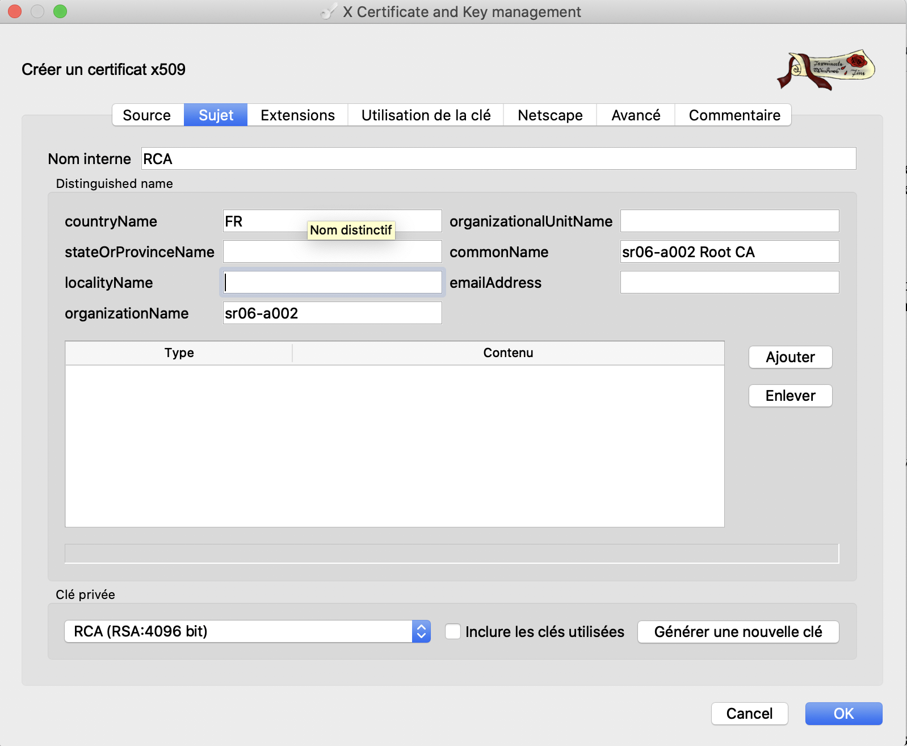
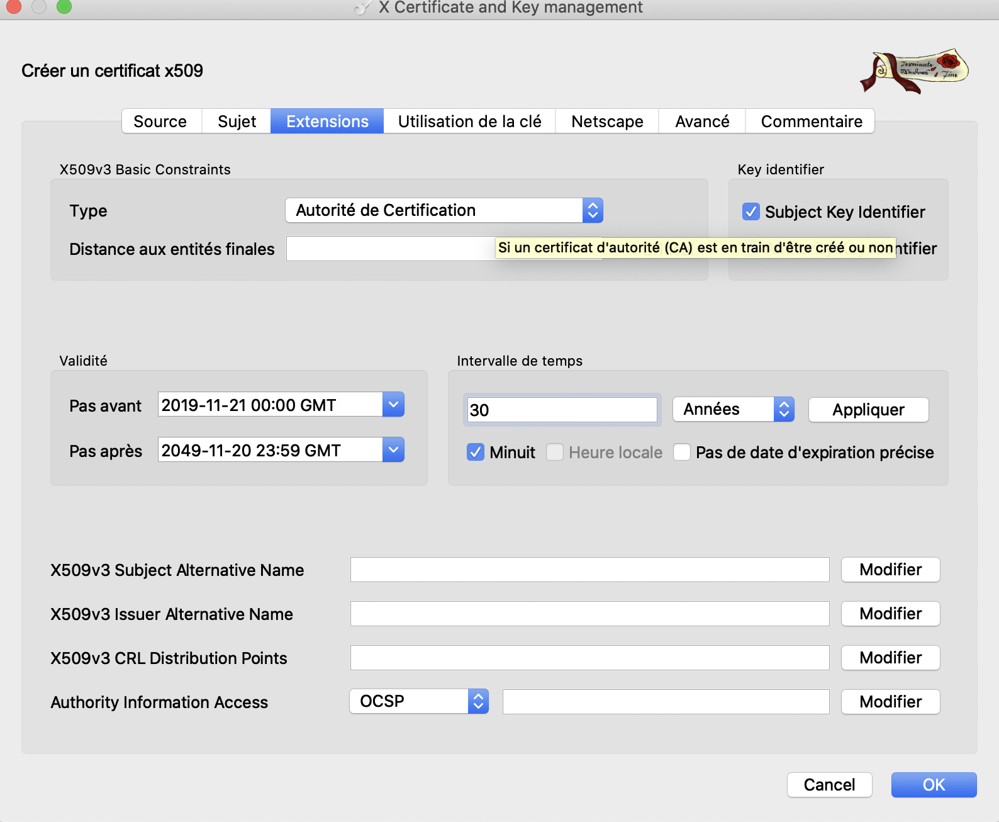
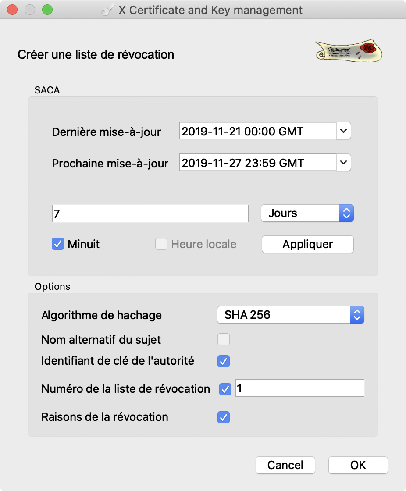

# PartieI:Mise en œuvre d’une PKI avec tinyCA2 & utilisation d’openssl 

* [x] Installez	**tinyCA2**. 

* [x] Mettez	en	œuvre	une	chaine	de	confiance	permettant	d’émettre:  

  * [x] Des	certificats	d’authentification	utilisateur; 
  * [x] Des	certificats	d’authentification	serveur. 

  

  

  

  Key identifier : générer fringerprint par MD5 pour identifier **Subject key** et **Authority key**

  Donc pour RCA, son subject key et authority key sont mêmes car il est auto signé.

  ```bash
  openssl x509 -in rca.pem -noout -text | less
  #pour regard rca.pem
  ```

  La	chaine	de	confiance	devra	posséder	les	caractéristiques	suivantes: 

  * [x] Au	moins	une	AC	subordonnée	non	opérationnelle; 
  * [x] Une	profondeur	minimale	de	3. 

  Générer	des	requêtes	de	certificats	afin	d’émettre: 

  * [x] Plusieurs	certificats	d’authentification utilisateur; 

  * [x] Plusieurs	certificats	d’authentification	serveur. 

    ```bash
    openssl genrsa -out server.key -des3 2048
    openssl req -new -key server.key -out server.csr
    #envoyer une requêtes de signature de certificat
    ```

  

* [x] Emettez	les	certificats. 

  

  

  

  

  

  Each extension in a certificate is designated as either `critical` or `non-critical`. A certificate-using system MUST reject the certificate if it encounters a critical extension it does not recognize or a critical extension that contains information that it cannot process. A non-critical extension MAY be ignored if it is not recognized, but MUST be processed if it is recognized.

* [x] Via	openssl,	décodez	les	certificats. 

  ```bash
  openssl x509 -in server_test.crt -noout -text | less
  ```

* [ ] A	l’aide	des	certificats	et	des	clés	privées,	générez	des	PKCS12. 

  ```bash
  pkcs12 -export -in server_test.crt -inkey server.key -out server_pkcs12 
  ```

* [ ] Via	openssl,	validez	un	certificat	serveur,	un	certificat	utilisateur. 

  ```bash
  openssl verify –CAfile <trust chain bundle> -verbose
  <certificate file>
  ```

* [x] Révoquez	un	certificat serveur,	un	certificat utilisateur. 

  

* [x] Emettez	les	CRLs. 

* [x] Vérifier	que	le numéro	de	série	des	de	chaque	certificat a	bien	été	ajouté	 à	la CRL. 

* [ ] Echangez	chaine	de	confiance	 avec	un	autre	groupe. 

* [ ] Faîtes	 une	 requête	 de	 certificat	 afin qu’au	 autre	 groupe	 puisse	 vous	 émettre	un	certificat	client. 

* [ ] Décodez	le	certificat	obtenu. 

* [ ] Validez	le	certificat	obtenu. 

* [ ] Générez	un	PKCS12	depuis	le	certificat	obtenu. 

* [ ] Chiffrez	 un	 fichier	 texte	 à	 l’aide	 du	 certificat	 obtenu	 puis	 fournissez	 le	 fichier chiffré	au	porteur	du	certificat		utilisé	pour	chiffrer	le	document. 

* [ ] Une	fois	en	possession	du	fichier	chiffré,	déchiffrez	le. 

* [ ] Réalisez	les	mêmes	opérations	avec	un	fichier	binaire. 

* [ ] A	 l’aide	 de	 la	 documentation	 openssl,	 signez	 un	 document	 (signature	 détachée)	 puis	 fournissez	le	 document	ainsi	 que	la	 signature	 détachée	à	 un	autre	groupe. 

* [ ] Une	 fois	 en	 possession	 du	 document	 ainsi	 que	 de	 sa	 signature	 détachée	 obtenu	d’un	autre	groupe,	vérifiez	la	signature.	 

* [ ] Encodez	un	fichier	en	base64. 

* [ ] Décodez	le	fichier	encodé	en	 base64	et	assurez-vous	 de	l’intégrité	 de	 ce	 dernier. 

  

Vous	connaissez	à	présent	la	grande	majorité	des	incantations	magiques	 les	plus utilisées	avec	openssl.


# Partie	II:	Apache	&	mod_ssl 

Les	 opérations	 suivantes	 sont	 à	 réalisées	 sur une	 machine	 virtuelle	 linux	 sur	 laquelle	**vous	possédez	le	compte	root**. 

* [x] Installez apache. 

* [x] Installez	mod_ssl. 

* [x] Installez	php. 

* [x] Vérifiez	le	bon	fonctionnement	d’apache. 

* [x] Créez	une	page	affichant	les	informations	système	via	php	(phpinfo). 

 * [x] Validez	le	bon	fonctionnement	d’apache	et	php. 

 * [x] A	 l’aide	 de	 la	 PKI	 mise	 en	 œuvre	 dans	 la	 partie	 I,	 émettez	 un	 certificat	 serveur	 pour	 votre	 instance	 d’apache	 (le	 CN	 du	 certificat	 doit	 obligatoirement	contenir	le	FQDN	de	votre	instance	Apache). 

 * [x] Configurez	mod_ssl pour	votre	instance	Apache	afin :  

    * [x] D’utilisez	le	certificat	émis	lors	de	l’étape	précédente ; 

      https://stackoverflow.com/questions/18787491/adding-certificate-chain-to-p12pfx-certificate

      ```bash
      #put all the certificates at the chain together in one crt
      openssl x509 -in trusted_ca.cer -inform DER -out trusted_ca.pem
      openssl x509 -in root_ca.cer -inform DER -out root_ca.pem
      cat clientcert.pem trusted_ca.pem root_ca.pem >> clientcertchain.pem
      #openssl pkcs12 -export -in clientcertchain.pem -out clientcertchain.pfx
      ```

    * [x] D’activer	le	SSL. 

 * [x] Validez	le	bon	fonctionnement	de	votre	instance	apache	SSL. 

 * [x] Le	navigateur	se	plaint.	Pourquoi ? 

   Verification error: self signed certificate in certificate chaine

 * [x] Mettez	 en	 œuvre	 les	 actions	 correctives	 permettant	 de	 supprimer	 le	 ‘Warning’	 obtenu	lors	 de	l’étape	précédente	et	 validez	à	nouveau le	 bon	 fonctionnement	de	votre	instance	apache	SSL.

   https://stackoverflow.com/questions/17597457/why-wont-curl-recognise-a-self-signed-ssl-certificate 

   ```bash
   #add RCA.crt in /usr/share/ca-certificates
   #modify /etc/ca-certificates.conf add RCA.crt
   sudo update-ca-certificates --fresh
   ```

Votre	instance apache	SSL	est	à	présent	fonctionnelle. 

 * [ ] En	utilisant	la	PKI	mise	en	œuvre	lors	de	la	Partie	I,	générez	un	certificat	 d’authentification	utilisateur. 
 * [ ] Via	openssl,	générez	un	fichier	PKCS depuis	le	certificat	généré	lors	de	 l’étape	précédente. 
 * [ ] Installez	le	certificat	d’authentification	client dans	votre	navigateur. 
 * [ ] Mettez	en	œuvre	l’authentification	 forte	par	certificat	 sur	 votre	instance	 apache	SSL. 
 * [ ] Validez	le	bon	fonctionnement	de	l’authentification	forte	par	certificat	sur	 votre	instance	apache	SSL. 
 * [ ] Générez	 une	 CRL	 pour	 l’AC	 ayant	 émis	 le	 certificat	 d’authentification	 utilisateur. 
 * [ ] Modifiez	 la	 configuration	 de	 mod_ssl	 afin	 de	 vérifier	 le	 statut	 de	 révocation	des	certificats	d’authentification	utilisateur. 
 * [ ] Essayez	 à	 nouveau	 de	 vous	 authentifier	 fortement	 sur	 votre	 instance	 apache	SSL.	Cela	fonctionne.	Pourquoi ? 
 * [ ] Révoquez	le	certificat	d’authentification	utilisateur	utilisé. 
 * [ ] Essayez	 à	 nouveau	 de	 vous	 authentifier	 fortement	 sur	 votre	 instance	 apache	SSL.	Cela	fonctionne.	Pourquoi ? 
 * [ ] Mettez	à	jour	la	CRL	configuré	dans	votre	instance	apache	SSL. 
 * [ ] Essayez	 à	 nouveau	 de	 vous	 authentifier	 fortement	 sur	 votre	 instance	 apache	SSL.	Cela	fonctionne.	Pourquoi ? 
 * [ ] Redémarrez	votre	instance	apache	SSL. 
 * [ ] Essayez	 à	 nouveau	 de	 vous	 authentifier	 fortement	 sur	 votre	 instance	 apache	SSL.	Vous	n’avez	plus	accès.	Pourquoi ? 
 * [ ] Demander	 à	 un	 autre	 groupe	 de	 vous	 émettre	 un	 certificat	 d’authentification	utilisateur. 
 * [ ] Essayez	 de	 vous	 authentifiez	 en	 utilisant	 ce	 certificat.	 Vous	 n’avez	 pas	 accès.	Pourquoi ? 
 * [ ] Modifiez	 la	 configuration	 de	 votre	 instance	 apache	 SSL	 afin	 de	 pouvoir	 utilisé	le	certificat	d’authentification	obtenu	depuis	un	autre	groupe. 
 * [ ] Essayez	 de	 vous	 authentifiez	 en	 utilisant	 ce	 certificat.	 Vous	 n’avez	 pas	 accès.	Pourquoi ? 
 * [ ] Demander	 au	 groupe	 vous	 ayant	 émis	 le	 certificat	 d’authentification	 utilisateur	de	vous	fournir	la	CRL	de	l’AC	ayant	émis	ce	certificat. 
 * [ ] Modifiez	 la	 configuration	 de	 votre	 instance	 apache	 SSL	 afin	 de	 consommer	cette	nouvelle	CRL 
 * [ ] Essayez	 de	 vous	 authentifiez	 en	 utilisant	 ce	 certificat.	 Cela	 fonctionne.	 Pourquoi ? 
 * [ ] Emettez	un	certificat	d’authentification	serveur	via	votre	PKI. 
 * [ ] Générez	un	fichier	PKCS
 * [ ] 	depuis	ce	nouveau	certificat. 
 * [ ] Installez	ce	certificat	dans	votre	navigateur. 
 * [ ] Essayez	 de	 vous	 authentifiez	 en	 utilisant	 ce	 certificat.	 Cela	 fonctionne.	 Pourquoi ? 
 * [ ] Modifiez	la configuration	de	votre	instance	apache	SSL	afin	de	retreindre	 l’accès	 aux	 seuls	 certificats	 émis	 par	 votre	 AC	 émettant	 les	 certificats	 d’authentification	utilisateur. 
 * [ ] Essayez	 de	 vous	 authentifier	 fortement	 en	 utilisant	 le	 certificat	 d’authentification	serveur.	Vous	n’avez	pas	accès.	Pourquoi ? 
 * [ ] Essayer	 de	 vous	 authentifier	 en	 utilisant	 le	 certificat	 d’authentification	 utilisateur	émis	par	votre	PKI.	Cela	fonctionne.	Pourquoi ? 

## Question	 bonus : 

Comment	mettre	 en	 œuvre	 une	 gestion	 des	 accès	 plus	fine	 sur	 une  application	 php	 en	 utilisant	 comme	 ‘principal’	 le	 DN	 du	 certificat	 d’authentification	utilisateur ?	Mettez	en	œuvre	une	solution	minimaliste.


# Partie	III:	openvpn	&	certificate	based	authentication (mode	solo) 

L’objectif	 de	 cette	 partie	 consiste	 à	 mettre	 en	 œuvre	 une	 instance	 openvpn	 permettant	 au	 client	 de	 s’authentifier	 fortement	 par	 certificat.	 Utilisez	 les	 ressources	 à	 disposition	 sur	 Internet	 et	 n’hésitez	 pas	 à	 demander	 assistance	 si	 vous	bloquez	sur	un	point. Partie	III	bis :	Mise	en	œuvre de	EAP-TSL	sur	freeradius (mode	solo) L’objectif	 de	 cette	 partie	 consiste	 à	 mettre	 en	 œuvre	 une	 instance	 radius	 (via	 freeradius)	 implémentant le	 protocole	 d’authentification	 EAP-TLS.	 Le	 bon	 fonctionnement	 du	 serveur	 radius	 permettrait,	 ultérieurement,	 de	 mettre	 en	 œuvre (la	liste	n’est	pas	exhaustive): • Le	802.1X	(switch	authentifiant,	accès	sans	fil) ; • L’authentification	pour	les	accès	externes	(VPN	Ipsec,	VPN	SSL). Utiliser	 les	 ressources	 à	 disposition	 sur	 Internet	 et	 n’hésitez	 pas	 à	 demander	 assistance	si	vous	bloquez	sur	un	point. NB : Pour	tester	le	bon	fonctionnement	du	protocole	EAP-TLS,	il	sera	nécessaire	de	 compiler	 l’outil ‘eapol_test’ disponible	 dans	 les	 sources	 du	 supplicant	 802.1x	 ‘wpa_supplicant’.


**Partie 1 : connexion sécurisée automatique**

- Depuis un compte du client Linux, créer des bi-clés (différentes) pour les utilisateurs *edite* et *publie* avec ssh-keygen ;
- Utiliser ssh-copy-id pour transférer les clés concernées sur le serveur ;
- Vérifier ensuite que les utilisateurs *edite* et *publie* peuvent se connecter automatiquement au serveur et réaliser les actions définies dans le projet Risque.