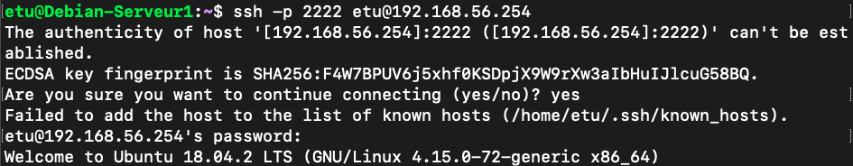

debian modify network interface : `/etc/netplan/50-cloud-init.yaml`

mais la configuration du routeur fonctionne pas.

```bash
sudo ip route add 192.168.58.0/24 via 192.168.56.254 dev ens18
```

## 2. Mise en place d’un processus SSHD en écoute sur le Serveur

* [x] Installer le package openssh-server. Démarrer le service ssh :

  ```bash
  systemctl restart ssh
  ```

* [x] Sur le Client, tentez de vous connecter sur le daemon ssh du serveur :

  ```bash
  ssh etu@192.168.58.2 (depuis Debain-Serveur1)
  ```

* [x] Si le prompt apparaît, cela signifie que vous êtes connecté, et donc inutile d’aller plus loin, faîtes Ctrl-C.

  ```bash
  #reset ssh private key
  sudo find / -name known_hosts
  sudo ssh-keygen -f  "/home/etu/.ssh/known_hosts" -R 192.168.58.2
  sudo systemctl restart ssh
  ```

  

## 3. Mise en place d’un filtrage IPtables sur le Serveur en INPUT.

* [x] Grâce à iptables, activer un filtrage sur la chaîne INPUT du serveur de manière à n’autoriser l’accès au daemon SSH que depuis la machine source 192.168.58.254. Tout le reste du traffic devra être interdit.

  ```bash
  sudo iptables -A INPUT -i ens20 -j ACCEPT
  sudo iptables -A INPUT -i lo -j ACCEPT
  sudo iptables -A INPUT -i ens18 -s 192.168.58.254 -p tcp --dport 22 -j ACCEPT
  sudo iptables -P INPUT DROP
  
  sudo iptables -A INPUT -o ens20 -j ACCEPT
  sudo iptables -A INPUT -o lo -j ACCEPT
  sudo iptables -A OUTPUT -o ens18 -d 192.168.58.254 -p tcp --sport 22 -j ACCEPT
  sudo iptables -P OUTPUT DROP
  ```

  ```bash
  ssh toto@192.168.58.2 (depuis le Routeur)
  ```

  

## 4. Mise en place d’un filtrage IPtables sur le routeur en FORWARD.

* [x] Toujours avec iptables , filtrer le traffic sur le routeur de manière à ne laisser passer que le traffic SSH du Client vers le Serveur.

  ```bash
  #Sur routeur
  sudo iptables -A FORWARD -i ens18 -o ens19 -p tcp --dport 22 -s 192.168.56.2 -d 192.168.58.2 -j ACCEPT
  sudo iptables -A FORWARD -o ens18 -i ens19 -p tcp --sport 22 -d 192.168.56.2 -s 192.168.58.2 -j ACCEPT
  sudo iptables -P FORWARD DROP
  
  #Sur le serveur
   sudo iptables -A INPUT -i ens18 -s 192.168.56.2 -p tcp --dport 22 -j ACCEPT
  sudo iptables -A OUTPUT -o ens18 -d 192.168.56.2 -p tcp --sport 22 -j ACCEPT
  ```

  ```bash
  ssh toto@192.168.58.2 (depuis le Client)
  ```

  

  

## 5. Mise en place de redirection de port sur le routeur

* [x] Toujours avec iptables mettre en place une translation d’adresse destination avec redirection de port, de manière à ce que , lorsque le client se connecte le port 2222 du Routeur, la requête arrive sur le port 22 du Serveur.

  ```bash
  sudo iptables -L -t nat
  sudo iptables -t nat -D PREROUTING 1
  
  sudo iptables -t nat -A PREROUTING -p tcp -d 192.168.56.254 --dport 2222 -j DNAT --to-destination 192.168.58.2:22
  #sudo iptables -t nat -A POSTROUTING -d 192.168.58.2 -p tcp --dport 22 -j SNAT --to-source 192.168.56.254:2222
  ```

  ```bash
  ssh –p 2222 toto@192.168.56.254 (depuis le Client)
  ```


