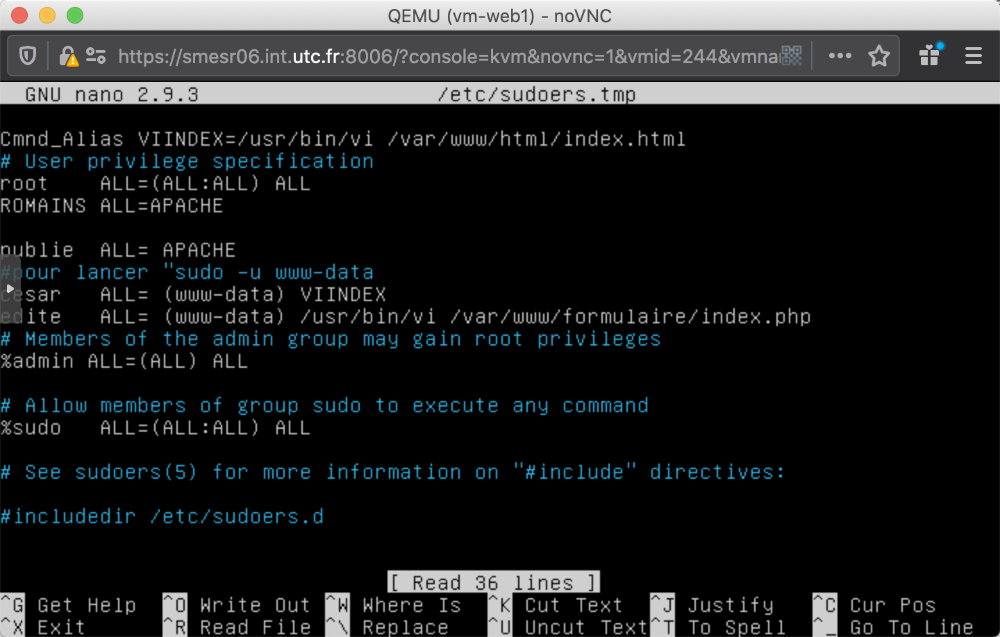
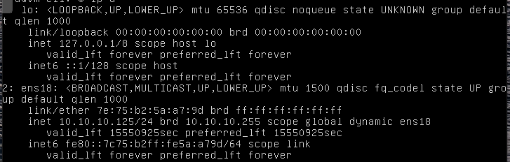
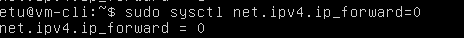

**TP1**

# **Projet du module risque**

Le **projet du module Risque** consiste à concevoir un système informatique composé de trois machines virtuelles en réseau sur la plateforme proxmox :

- un serveur Linux 
- un client Linux connecté au serveur par un premier réseau ;
- un client Windows connecté au serveur par un second réseau, distinct du précédent.

Les machines virtuelles serveur Linux et client Windows sont issues des TD. Le client Linux est à installer. L'ensemble de ce système informatique doit vérifier les prescriptions ci-dessous. Il sera complété avec les projets des modules suivants.


## **1. Serveur Linux vm-web** 

Cette machine virtuelle est issue de la machine virtuelle *passoire* fournie en TD. Elle aura pour rôle d'héberger un serveur web.

### 1. Application des corrections vues au TD.R1, en particulier :

* [x] Recherche des mots de passe évidents et correction. On expliquera la stratégie utilisée pour construire des mots de passe robuste.
* [x] Correction des comptes utilisateurs ;
* [ ] Correction des droits des fichiers (dont setuid bit, sticky bit...) ;
* [x] Umask restrictif ;
* [x] Correction des anomalies dans les droits des fichiers.

### 2. Configuration réseau vue au TD.R2 :

* [x] Suppression de l'interface virb0.

* [x] Renommage de la vm en "vm-web".

* [x] Désactivation de telnet.

  Dans le fichier `/etc/services`, on a commenté `port 23`

  

### 3. Services

* [x] Mettre en oeuvre le serveur Apache ; il n'est pas demandé de configurer https à ce stade ;

* [x] Développer un formulaire le plus simple possible qui permette de saisir des noms et de les stocker dans un fichier.

  ```bash
  sudo chown www-data:www-data -R /var/www/formulaire
  #
  ```

* [ ] S'assurer qu'il n'y ait pas de service inutile lancé avec un scan de port local.

  ```bash
  nmap 127.0.0.1
  ```

  maintenant il reste ssh et http

  **je pense qu'on doit tuer ssh?**

* [ ] Désinstaller les applications non nécessaires pour cette machine virtuelle destinée à héberger un serveur web (eg. lynx).

  ```bash
  apt list --installed
  apt remove lynx
  ```
  
  

### 4. Utilisateurs

* [x] Créer autant de comptes utilisateurs privilégiés que d'étudiants dans votre groupe (ne pas partager un compte utilisateur privilégié) ;

  * compte privilégié -> UID=0

  ```bash
  sudo useradd -o -u 0 -g 0 -M -d /root -s /bin/bash <username>
  sudo passwd <username>
  ```

* [x] Créer un compte utilisateur non privilégié *publie* qui ait le droit d'arrêter et de relancer le serveur web (utiliser sudo) :

  ```bash
  adduser publie
  sr06a002publie
  ```

  

* [x] Créer un compte utilisateur non privilégié *edite* qui ait le droit de modifier la page web (contenant le formulaire PHP).

  

* [ ] Optionnel : créer un compte utilisateur *controle* en cage (avec chroot), qui ait uniquement le droit d'afficher les processus en cours d'exécution ;

### 5. Ajout de disques et de partition (optionnel)

* [ ] Réalier un *snapshot* de votre machine virtuelle avant cette étape.
* [ ] Ajouter un disque dur (taille conseillée de 250 Mo pour limiter l'encombrement).
* [ ] Repérer au démarrage le nouveau périphérique avec dmesg.
* [ ] Partitionner ce nouveau disque avec fdisk en créant deux partitions : /var et /home.
* [ ] Dans chacune des partitions, créer un système de fichier ext4 avec fsck.ext4.
* [ ] Monter temporairement ces partitions et y copier les contenus des répertoires actuels /var et /home.
* [ ] Modifier /etc/fstab de sorte que ces deux nouvelles partitions soient utilisées à la place des répertoires actuels /var et /home du premier disque. Utiliser les options de montage nosuid, nodev, noexec.


## **2. Réseau de vm** 

Cette partie consiste à créer le système représenté sur la figure ci-dessus.

### 1. Création d'une seconde machine virtuelle, qui aura le rôle de client web (cependant on n'utilisera pas d'interface graphique pour ne pas surcharger la plate-forme).

* [x] Cloner la machine virtuelle vm-web.
* [x] Renommer cette machine en "vm-cli".
* [x] Supprimer tous les services non indispensables (dont Apache) sur vm-cli (conserver tout de même ssh).
* [x] Ajouter le client web (non graphique) lynx.

### 2. Configuration réseau

* [x] Dans `vm-web`, ajouter une seconde interface réseau sur le réseau vmbr1 de sorte que le serveur Linux soit connecté aux deux réseaux (cf. figure ci-dessus).

* [x] S'assurer que vm-cli ait bien une seule interface réseau sur `vmbr0`.

  

* [x] Sur vm-web, interdire le routage entre les deux interfaces réseaux (configuration de net.ipv4.ip_forward via sysctl).

  http://www.octetmalin.net/linux/tutoriels/ip-forward.php

  

* [x] Modifier les fichiers /etc/hosts afin d'associer les noms vm-cli et vm-web aux IP.

* [x] Vérifier que vm-cli et vm-web puissent communiquer via le réseau vmbr0. En particulier, tester la consultation du serveur web de vm-web depuis vm-cli (avec lynx).

  ```bash
  sudo tcpdump -n -i ens18
  lynx vm-web1
  ```

### 3. Test du réseau vmbr1 (optionnel)

* [ ] Cloner vm-cli en vm-int.
* [ ] Modifier la configuration réseau de vm-int afin qu'elle n'ait qu'une seule interface réseau, sur le réseau vmbr1.
* [ ] Tester le serveur web de vm-web depuis vm-int. Tester l'absence de communication entre vm-cli et vm-int.


## **3. Client Windows**

Cette partie consiste à préparer une machine virtuelle Windows vm-win et de la placer dans le réseau vmbr1 (cf. figure).

1. Préparation de vm-win
   * [x] Partir de la machine virtuelle utilisée en TD. La renommer vm-win.
     * [x] Sélectionnez l'icône du bureau "Ce PC", et par un clic droit dessus, affichez ses propriétés
   
     * [x] Renommez le nom de l'ordinateur en "W10" et le groupe de travail en "SR06-WIN10". Redémarrez ensuite la machine virtuelle comme demandé par Windows
* [x] Appliquer les configurations demandées en TD.
   * [x] Configurer le réseau de sorte que cette machine ait une interface réseau sur le réseau vmbr1 (cf. figure).
   
     pour désactiver vmbr0 
   
     Réseau internet -> Ethernet -> centre réseau et partage -> modifier les paramètres et la carte -> alt
   
     pour type de cette carte réseau, c'est E1000 pas virtio
   
   * [x] Tester le formulaire web du serveur linux `vm-web` depuis `vm-win`.
2. Partie A
   * [x] Créez un groupe "g3" qui aura pour membres "u1", "u11" et "u2".
   
   * [x] A la racine du "Disque local C", créez un dossier "Data". Dans le dossier "Data\", créez un dossier "Public" et un dossier "Private". Dans le dossier "Private\", créez un dossier "G1".
   
   * [x] Dans le dossier "G1\", créez un fichier texte "Read-only" ; éditez-le et saisissez la ligne "Modifiez-moi" puis enregistrez ce changement. Copiez ce fichier dans le dossier "Public\".
   
* [x] Autorisez l'accès en lecture-écriture au dossier "Data\" (et à son contenu) pour l'utilisateur "formation".
  
   * [x] Autorisez en lecture seule l'accès au dossier "Data\Public\" (et à son contenu) au groupe "g3"
   
      onglet sécurité
   
   * [x] Autorisez en lecture-écriture l'accès au dossier "Data\Private\G1\" (et à son contenu) au groupe "g1" et l'accès en lecture seule au groupe "g2".
   
3. Partie B
   * [ ] A la manière de ce que vous feriez sous Linux à l'aide du droit "--x" fixé sur un dossier, composez, avec les ACL Windows une émulation de ce droit "--x" sur le dossier "Data\Private\", pour le groupe "g3".
   
     Commande PowerShell : **Get-Acl**
   
     ```
     Get-Acl -Path FICHIER
     ```
   
   
   Cette commande permet d'extraire l'ACL (Access Control Lists) d'un fichier ou d'un dossier. L'ACL définie les permissions dont bénéficient les utilisateurs et les groupes lorsqu'ils accèdent au fichier/dossier concerné.

Commande PowerShell : Set-Acl
    Set-Acl -Path <FICHIER> -AclObject <$DROITS_ACCES>

Cette commande permet de définir l'ACL (Access Control Lists) d'un fichier ou d'un dossier. L'ACL appliquée sera celle définie dans la variable `DROITS_ACCES`. Il est possible de définir cette variable ​`DROIT_ACCES` grâce au résultat de la commande Get-Acl.

https://docs.microsoft.com/fr-fr/powershell/module/microsoft.powershell.security/set-acl?view=powershell-6

   * [ ] Changez de session et ouvrez une nouvelle session avec l'utilisateur "u1".
   
   * [ ] Allez dans le dossier "Data\Public\" et modifiez le fichier "Read-only". Que constatez-vous ?
   
   * [ ] Allez dans le dossier "Data\Private\". Que constatez-vous ? Allez dans le dossier "Data\Private\G1\". Que constatez-vous ?Dans le dossier "Data\Private\G1\", constatez que vous pouvez modifier le fichier "Read-only" en rajoutant la ligne "Modifié par u1".Changez de session et ouvrez une nouvelle session avec l'utilisateur "u2".
   
   * [ ] Constatez que vous ne pouvez pas modifier le fichier "Data\Private\G1\Read-only", pas plus que le fichier "Data\Public\Read-only".Changez de session et rouvrez la session de l'utilisateur "formation".Sur le dossier "Data\Private\", supprimez tout droit d'accès pour le groupe "g3".Changez de session et rouvrez la session de l'utilisateur "u1".
   
   * [ ] Allez dans le dossier "Data\Private\". Que constatez-vous ?
   
   * [ ] Allez dans le dossier "Data\Private\G1\". Que constatez-vous ?
   
   * [ ] Expliquez en quoi ce comportement est-il différent de celui que vous obtiendriez avec Linux en fixant exactement les mêmes droits sur les mêmes dossiers "Data\", "Data\Private\" et "Data\Private\G1\"Partie C

4. Partie C
   * [ ] Changez de session et rouvrez la session de l'utilisateur "formation".
   * [ ] Créez le dossier "Data\Sticky".
   * [ ] A la manière de ce que vous feriez sous Linux à l'aide du bit "t" (sticky bit) fixé sur un dossier, composez, avec les ACL Windows une émulation de ce sticky bit sur le dossier "Data\Sticky\" pour le groupe "g3". Vous aurez à utiliser, parmi les ACL requises, une concernant l'utilisateur spécial "CREATEUR PROPRIETAIRE".
   * [ ] En utilisant les sessions des utilisateurs "formation", "u1", "u11", "u2", dans le dossier "Data\Sticky\", créez des dossiers et des fichiers. Pour mettre en évidence le bon fonctionnement de votre émulation de sticky bit sur le dossier "Data\Sticky\", tentez de lire, modifier ou supprimer les dossiers ou fichiers créés par un autre utilisateur que celui qui effectue ces actions.


## **4. Surveillance du serveur web**

### 1. Surveillance des log Apache

* [ ] Se connecter sur vm-web depuis vm-cli et visualiser les logs du serveur Apache.

  ```bash
  
  ssh etu@vm-web1
  ```

* [ ] Se connecter au serveur web de vm-web depuis vm-win ; expliquer les logs obtenus.

### 2. Capture de trafic

* [ ] Capturer le trafic sur l'interface réseau de vm-web qui est connectée à vmbr1 avec tcpdump.
* [ ] Renvoyer ce trafic sur votre PC gracli et visualiser ces traces avec wireshark (cf. TD.R2). Expliquer.