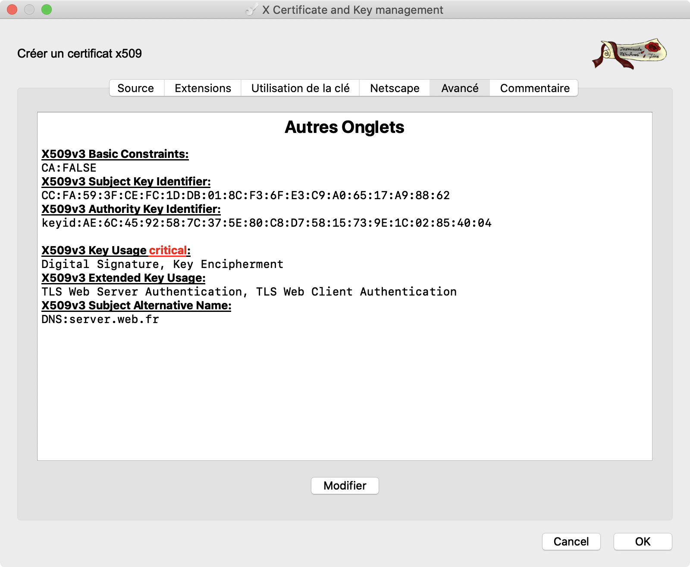

## Projet du module Cryptographie - Automne 2019

Le **projet du module Cryptographie** consiste à compléter le système informatique issu du projet précédent (module Risque) avec une sécurisation des échanges.

Pour rappel, l'architecture du SI est composée de trois machines virtuelles en réseau :

- un serveur Linux servant des pages web via Apache/PHP ;
- un client Linux connecté au serveur par un premier réseau, vmbr0 ;
- un client Windows connecté au serveur par un second réseau, vmbr1.


Le but du projet est de déployer TLS/SSL dans le serveur web en utilisant un des deux logiciel suivants :

- - XCA ([https://hohnstaedt.de/xca/](https://antispam.utc.fr/proxy/2/QmVydHJhbmQuRHVjb3VydGhpYWxAdXRjLmZy/hohnstaedt.de/xca/) recommandé)
  - TinyCA 2


**1. Chaîne de confiance**

Mettre en oeuvre une chaîne de confiance permettant d’émettre des certificats :

* [x] D’authentification serveur (permettant de mettre en place le SSL/TLS sur un serveur web);
* [x] D’authentification client (permettant de mettre en oeuvre de l’authentification du client sur un serveur web).

La chaine de confiance devra respecter les contraintes suivantes :

* [x] Chaine de confiance 3 tiers (3 niveaux d’AC);
* [x] Ségrégation par usage, l’authentification d’un client étant considéré comme un usage différent de l’authentification d’un serveu).

**2. Utilisation**

Sur le serveur web, mettre en oeuvre :

* [ ] Un vhost avec le module SSL actif et correctement configuré (aussi bien sur le navigateur qui servira pour la démonstration côté client que pour le serveur) ;

  

* [ ] Une authentification du client par certificat ;

* [ ] Un contrôle de CRL dans la configuration du serveur web ; vérifier qu’il n’est plus possible d’authentifier un client possédant un certificat révoqué.

**Pour rappel :**

- Un profil de certificat d’AC doit contenir les éléments suivants :

- * [x] Key Usage: CRL Sign, Certificate Sign (critical)
  * [x] Extended Key Usage : aucun
  * [x] Basic Constraint: CA = TRUE

- Un profil de certificat pour de l’authentification serveur doit contenir:

- * [x] Key Usage: Digital Signature, Key Encipherment (critical)
  * [x] Extended Key Usage: Server Auth
  * [x] Basic Constraint: Aucun

- Un profil de certificat pour de l’authentification client doit contenir :

- * [x] Key Usage: Digital Signature, Key Encipherment (critical)
  * [x] Extended Key Usage: Client Auth
  * [x] Basic Constraint: Aucun


```bash
scp etu@172.23.3.125:server.csr .
```

