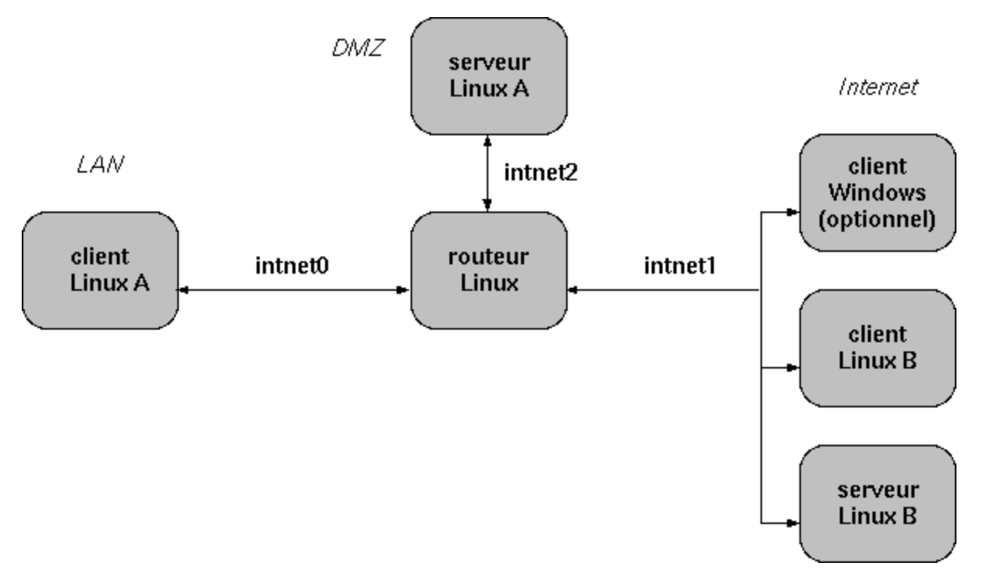

Le projet du module *Protection* consiste à :

1. S'initier à la sécurisation d'une application web ;
2. Compléter l'architecture construite dans les projets précédents en définissant des zones de confiance de niveaux différents pour isoler le service web :
3. Pour les GI04 et plus, ajout d'un serveur DNS et d'une connexion ssh par certificat.

## 1. Sécuriser une application

Le but est de s'initier à la sécurisation d'une application PHP en utilisant PHP_CodeSniffer.

* [ ] Installer le package php-codesniffer dans la machine virtuelle hébergeant le serveur web. Une documentation peut être trouvée ici https://github.com/squizlabs/PHP_CodeSniffer/wiki.
* [ ] Lancer le script phpcs sur vos fichiers php et analyser les résultats.
* [ ] Développer une page PHP avec puis sans protection, en vous inspirant de la page https://www.php.net/manual/fr/security.database.sql-injection.php.
* [ ] Lancer le script phpcs sur ces pages web et analyser les résultats.
* [ ] Pourquoi est-il préférable de ne pas laisser le logiciel php-codesniffer sur la machine hébergeant le serveur Apache ?

## 2. Protection de l'infrastructure réseau

Le but est de compléter l'architecture construire dans les projets précédents en ajoutant une DMZ pour isoler le service web.

* [ ] La zone *LAN* correspond au réseau interne de l'entreprise. Elle doit comporter au minimum un client Linux Desktop (client A).
* [ ] La zone *Internet* correspond au réseau externe ; elle doit comporter au minimum un client Linux Desktop (client B) et un serveur Linux proposant un site web (serveur B).
* [ ] La zone *DMZ* est une zone de confiance intermédiaire, qui comporte au minimum le serveur web de l'entreprise (serveur A).

### 2.1 Création des VM et des réseaux

* [ ] Toutes ces machines virtuelles sont connectées via des réseaux internes (un par zone de confiance), comme indiqué sur la figure ci-dessous.
* [ ] Le second client linux et le second serveur Linux peuvent être obtenus par clonage des VM des projets précédents. Il est conseillé d'utiliser des clones pour optimiser l'espace disque.
* [ ] La VM Windows est optionnelle et dépend de la mémoire disponible (à noter que les VM Linux n'ont pas besoin de beaucoup de mémoire).
* [ ] Les deux serveurs Linux doivent proposer des sites web différents et afficher notamment la bannière "Site web de l'entreprise A" ou "Site web de l'entreprise B".
* [ ] Chaque VM pourra garder une carte réseau supplémentaire configurée en NAT.
* [ ] S'assurer que les plans d'adressage sont différents sur chaque réseau et que les machines d'un même réseau peuvent communiquer ensemble.

 

### 2.2 Configuration du routage et du filtrage

Il s'agit de configurer le routage et le filtrage sur le routeur Linux de sorte que :

* [ ] Le client A (interne au réseau de l'entreprise) puisse contacter le serveur web de l'entreprise A.
* [ ] Le client A puisse contacter le serveur web B, externe à l'entreprise.
* [ ] Le client B (externe) puisse contacter les serveurs A et B.
* [ ] Aucune connexion ne puisse atteindre les machines du LAN.
* [ ] Aucune connexion ne puisse être initiée depuis la DMZ à destination des autres zones.

## 3. Installation d'un serveur ssh et d'un DNS (GI04 et plus uniquement)

Cette partie n'est pas à réaliser par les étudiants de début de branche. Le but est d'ajouter un serveur DNS dans la DMZ ainsi qu'un serveur ssh.

* [ ] Ajouter un serveur DNS dans la DMZ et adapter les règles de routage en conséquence. Le serveur devra permettre de trouver l'adresse du serveur web à partir de son nom.
* [ ] Ajouter un serveur ssh dans la DMZ et adapter les règles de routage en conséquence. Les clients A et B devront pouvoir s'y connecter. Mettre en place une connexion sécurisée par certificat en utilisant la PKI du projet précédent.