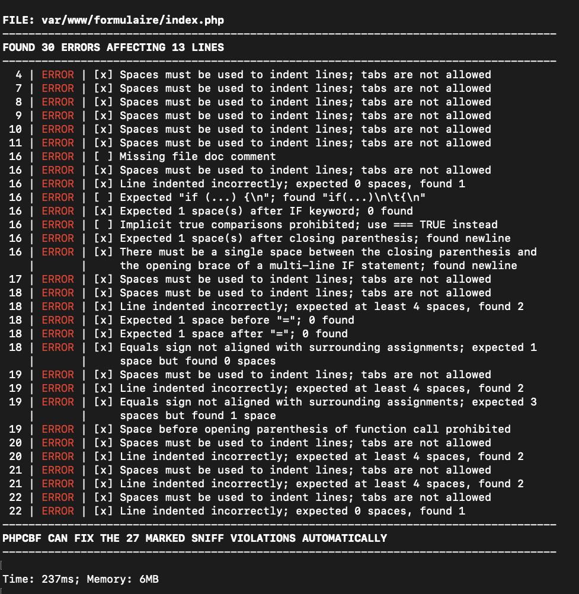
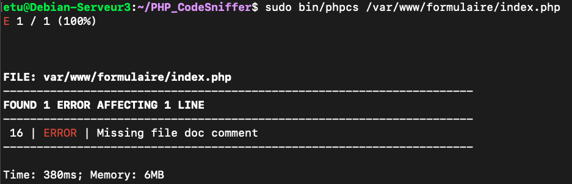

Le projet du module *Protection* consiste à :

1. S'initier à la sécurisation d'une application web ;
2. Compléter l'architecture construite dans les projets précédents en définissant des zones de confiance de niveaux différents pour isoler le service web :
3. Pour les GI04 et plus, ajout d'un serveur DNS et d'une connexion ssh par certificat.


## 1. Sécuriser une application

Le but est de s'initier à la sécurisation d'une application PHP en utilisant PHP_CodeSniffer.

* [x] Installer le package php-codesniffer dans la machine virtuelle hébergeant le serveur web. Une documentation peut être trouvée ici https://github.com/squizlabs/PHP_CodeSniffer/wiki.

  ```bash
  # Download using curl
  curl -OL https://squizlabs.github.io/PHP_CodeSniffer/phpcs.phar
  curl -OL https://squizlabs.github.io/PHP_CodeSniffer/phpcbf.phar
  
  # Then test the downloaded PHARs
  php phpcs.phar -h
  php phpcbf.phar -h
  
  
  sudo apt-get install php-xml
  sudo service apache2 restart
  ```

  ```bash
  sudo vim /etc/systemd/resolved.conf 
  #######
  [Resolve]
  DNS=195.83.155.55
  #######
  sudo service systemd-resolved restart
  sudo systemd-resolve --status
  ```

  

* [x] Lancer le script phpcs sur vos fichiers php et analyser les résultats.

  ```bash
  sudo ~/PHP_CodeSniffer/bin/phpcs /var/www/formulaire/index.php
  
  #vim show line number:
  : set number
  ```

  

  

* [x] Développer une page PHP avec puis sans protection, en vous inspirant de la page https://www.php.net/manual/fr/security.database.sql-injection.php.

* [ ] Lancer le script phpcs sur ces pages web et analyser les résultats.

* [ ] Pourquoi est-il préférable de ne pas laisser le logiciel php-codesniffer sur la machine hébergeant le serveur Apache ?

## 2. Protection de l'infrastructure réseau

Le but est de compléter l'architecture construire dans les projets précédents en ajoutant une DMZ pour isoler le service web.

* La zone *LAN* correspond au réseau interne de l'entreprise. Elle doit comporter au minimum un client Linux Desktop (client A).

* La zone *Internet* correspond au réseau externe ; elle doit comporter au minimum un client Linux Desktop (client B) et un serveur Linux proposant un site web (serveur B).

* La zone *DMZ* est une zone de confiance intermédiaire, qui comporte au minimum le serveur web de l'entreprise (serveur A).


### 2.1 Création des VM et des réseaux

* [x] Toutes ces machines virtuelles sont connectées via des réseaux internes (un par zone de confiance), comme indiqué sur la figure ci-dessous.

* [x] Le second client linux et le second serveur Linux peuvent être obtenus par clonage des VM des projets précédents. Il est conseillé d'utiliser des clones pour optimiser l'espace disque.

* [ ] La VM Windows est optionnelle et dépend de la mémoire disponible (à noter que les VM Linux n'ont pas besoin de beaucoup de mémoire).

* [x] Les deux serveurs Linux doivent proposer des sites web différents et afficher notamment la bannière "Site web de l'entreprise A" ou "Site web de l'entreprise B".

  ```bash
  sudo -u www-data vim /var/www/formulaire/index.php
  sudo systemctl reload apache2
  ```

  

* [ ] Chaque VM pourra garder une carte réseau supplémentaire configurée en NAT.

* [x] S'assurer que les plans d'adressage sont différents sur chaque réseau et que les machines d'un même réseau peuvent communiquer ensemble.

 

### 2.2 Configuration du routage et du filtrage

Il s'agit de configurer le routage et le filtrage sur le routeur Linux de sorte que :

* **serveurA : 192.168.60.2**

* [x] **Le client A (interne au réseau de l'entreprise) puisse contacter le serveur web de l'entreprise A.**

* [x] **Le client A puisse contacter le serveur web B, externe à l'entreprise.**

* [x] **Le client B (externe) puisse contacter les serveurs A et B.**

* [ ] **Aucune connexion ne puisse atteindre les machines du LAN.**

  sur client A

  ```bash
  sudo iptables -A INPUT -i ens20 -j ACCEPT
  sudo iptables -A INPUT -i lo -j ACCEPT
  sudo iptables -A INPUT -i ens18 -s 192.168.60.2 -p tcp --dport 80 -j ACCEPT
  sudo iptables -A INPUT -i ens18 -s 192.168.58.2 -p tcp --dport 80 -j ACCEPT
  sudo iptables -P INPUT DROP
  ```

  

* [ ] **Aucune connexion ne puisse être initiée depuis la DMZ à destination des autres zones.**

  sur serveur A

  ```bash
  sudo iptables -A OUTPUT -o ens20 -j ACCEPT
  sudo iptables -A OUTPUT -o lo -j ACCEPT
  sudo iptables -A OUTPUT -o ens18 -d 192.168.56.2 -p tcp --sport 80 -j ACCEPT
  sudo iptables -A OUTPUT -o ens18 -d 192.168.58.3 -p tcp --sport 80 -j ACCEPT
  sudo iptables -P OUTPUT DROP
  ```

  

## **3. Installation d'un serveur ssh et d'un DNS (GI04 et plus uniquement)**

**Cette partie n'est pas à réaliser par les étudiants de début de branche. Le but est d'ajouter un serveur DNS dans la DMZ ainsi qu'un serveur ssh.**

* [x] **Ajouter un serveur DNS dans la DMZ et adapter les règles de routage en conséquence. Le serveur devra permettre de trouver l'adresse du serveur web à partir de son nom.**

  https://www.digitalocean.com/community/tutorials/how-to-configure-bind-as-a-private-network-dns-server-on-debian-9#configuring-dns-clients

  ```bash
  sudo apt-get install bind9 bind9utils bind9-doc
  
  sudo vim /etc/bind/named.conf.local
  zone "sr06a002.com"  { type master; file "/etc/bind/zones/db.sr06a002.com"; };
  sudo mkdir /etc/bind/zones
  sudo cp /etc/bind/db.local /etc/bind/zones/db.sr06a002.com
  sudo named-compilezone -o - 58.168.192 /etc/bind/zones/db.192.168.58
  sudo named-compilezone -o - ns.sr06a002.com /etc/bind/zones/db.sr06a002.com
  sudo /etc/init.d/bind9 restart
  
  #sur VM clientA
  ### set nameserver
  sudo vim /etc/netplan/00-private-nameservers.yaml
  ######
  network:
      version: 2
      ethernets:
          ens18:                                 # Private network interface
              nameservers:
                  addresses:
                  - 192.168.60.3                # Private IP for ns1
                  search: [ sr06a002.com ]  # DNS zone
  #####
  sudo netplan try
  sudo systemd-resolve --status
  
  sudo apt-get update
  sudo apt-get install resolvconf
  sudo vim /etc/resolvconf/resolv.conf.d/head
  ####
  nameserver 192.168.60.3
  ####
  sudo systemctl start resolvconf.service
  
  #sur CM client
  #######
  dig serveura.sr06a002.com
  etu@ClientA:~$ nslookup ns.sr06a002.com
  ;; Got SERVFAIL reply from 192.168.60.3, trying next server
  Server:		127.0.0.53
  Address:	127.0.0.53#53
  
  ** server can't find ns.sr06a002.com: SERVFAIL
  
  
  #########
  
  #sur DNS serveur
  #####
  sudo /etc/init.d/bind9 restart
  etu@ServeurDNS:~$ sudo tail /var/log/syslog
  Jan  5 12:49:08 ServeurDNS named[24267]: zone 58.168.192.in-addr.arpa/IN: not loaded due to errors.
  Jan  5 12:49:08 ServeurDNS named[24267]: zone 60.168.192.in-addr.arpa/IN: loading from master file /etc/bind/zones/db.192.168.60 failed: permission denied
  Jan  5 12:49:08 ServeurDNS named[24267]: zone 60.168.192.in-addr.arpa/IN: not loaded due to errors.
  Jan  5 12:49:08 ServeurDNS named[24267]: zone 56.168.192.in-addr.arpa/IN: loading from master file /etc/bind/zones/db.192.168.56 failed: permission denied
  Jan  5 12:49:08 ServeurDNS named[24267]: zone 56.168.192.in-addr.arpa/IN: not loaded due to errors.
  Jan  5 12:49:08 ServeurDNS named[24267]: zone localhost/IN: loaded serial 2
  Jan  5 12:49:08 ServeurDNS named[24267]: zone sr06a002.com/IN: loading from master file /etc/bind/zones/db.sr06a002.com failed: permission denied
  Jan  5 12:49:08 ServeurDNS named[24267]: zone sr06a002.com/IN: not loaded due to errors.
  Jan  5 12:49:08 ServeurDNS named[24267]: all zones loaded
  Jan  5 12:49:08 ServeurDNS named[24267]: running
  #######
  
  sudo chown root:bind /etc/bind/zones
  sudo chmod 755 /etc/bind/zones
  sudo chmod +s /etc/bind/zones
  ```

* [ ] **Ajouter un serveur ssh dans la DMZ et adapter les règles de routage en conséquence. Les clients A et B devront pouvoir s'y connecter. Mettre en place une connexion sécurisée par certificat en utilisant la PKI du projet précédent.**

  https://forums.gentoo.org/viewtopic-t-441064-start-0.html

  ```bash
  sudo ip route add 192.168.58.0/24 via 192.168.60.254 dev ens18
  sudo ip route add 192.168.56.0/24 via 192.168.60.254 dev ens18
  
  #Sur client A
  ssh-keygen -f clienta.key -C "clientA CA key"
  #sr06a002clienta
  openssl req -new -key clienta.key -out clienta.csr
  #change name of clienta.key to id_test and move it to ~/.ssh
  ssh-keygen -y -f ~/.ssh/id_test > ~/.ssh/id_test.pub
  
  #证书的权限 - 400
  
  #sur la machine PKI
  scp etu@172.23.3.104:clienta.csr .
  #et puis signer le requête et revoie
  scp /Users/haida/Projects/sr06-a19/PKI/ssh.sr06a002.com.crt etu@172.23.3.104:/home/etu
  
  
  ```

  